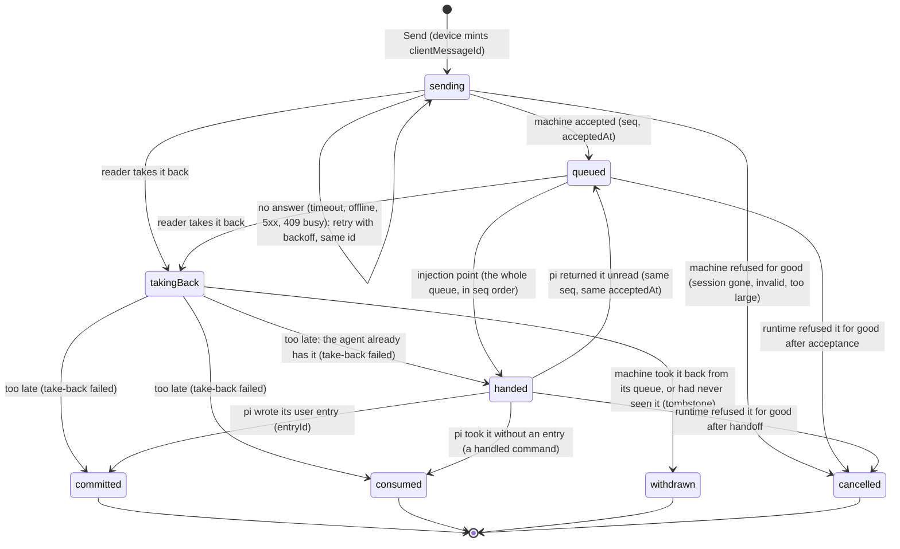

# Message states: a message is never lost and never fails for good

Status: design, waiting for the owner (2026-10-04). Revises D1 in
`state-diagram.md`.

## The owner's rules (2026-10-04)

- A send is retried, idempotently, until the machine answers. A message does
  not fail for good: it is either still on its way (in the queue, sending) or
  cancelled.
- Retry and Discard go. The one thing a reader does to a message on its way is
  take it back.
- A take-back of a message whose arrival is unknown is a request, not a fact.
  If the machine turns out to have taken the message, the message counts as
  taken and the take-back failed.
- A message's time is the time the machine actually took it, as the machine
  reports it.
- Every state a message can be in is named, with when it holds, what moves it,
  and what happens when the device and the machine disagree or a request is
  repeated. Which states the device knows and which the machine has confirmed
  are kept apart, and so is order.

## Two owners, one record

One record per `clientMessageId`, minted by the device when the reader presses
Send. It has exactly one state at a time, which the row, the pending block and
the queue list all draw.

- **The device owns** the record until the machine has answered about it once:
  `sending`, `takingBack`.
- **The machine owns** it from its first answer on: `queued`, `handed`,
  `committed`, `consumed`, `withdrawn`, `cancelled`.

The device never moves a machine-owned record by itself. It learns every
machine move from a frame or from a reconciliation read (below), and a later
device action (take back) is a request the machine answers.

## Device states

### `sending`

The device holds the record in its durable outbox (survives reloads and
restarts of the browser) and sends it until the machine answers.

- **Order.** One session's outbox on one device is sent strictly in order: the
  next record is not sent until the one before it is answered (accepted,
  cancelled or withdrawn). Without this, a retry of message 1 could arrive after
  message 2 and the machine would queue them reversed.
- **Retry schedule.** At once; then 1 s, doubling to 30 s; reset to "at once"
  whenever the link comes back (socket open, `online`, page load, session open).
  No age limit: a message written offline yesterday is delivered when this
  device next reaches the machine, unless taken back first. It shows as
  "Sending…" all that time.
- **Which answers end it.**

  | Answer | Meaning | Next |
  |---|---|---|
  | accepted, or "already have it" with the ledger's state | the machine owns it | that machine state |
  | no answer: timeout, network error, 5xx, 409 busy, 429 | unknown | stay `sending`, retry |
  | 404 session gone, 400 invalid, 413 too large | can never succeed | `cancelled` with that reason |

  A definite refusal is the only way a message on its way ends without the
  reader, and it is always a cancellation with a reason, never "failed, retry".
- **Before the session exists** (sent while a new session starts): the same
  state, held until the session answers; nothing new.

### `takingBack`

The reader pressed Take back on a message the machine has not yet answered
about. The device sends `withdraw(clientMessageId)` (idempotent, retried on the
same schedule) and keeps the row, marked "Taking back…". The words return to the
composer only when the machine confirms.

## Machine states

These exist today (D1, B33) and keep their meaning: `queued` (with `seq` and
`acceptedAt`), `handed`, `committed` (with `entryId`), `consumed`, `withdrawn`.
Two changes:

- **`cancelled`** replaces `refused`: a terminal refusal by the runtime after
  acceptance. The words go back to the composer, and a notice names the session
  and the reason. Nothing offers Retry; sending the words again makes a new
  message.
- **Take-back of an id the machine never saw** writes a tombstone: the ledger
  records the id as `withdrawn`. A send of that id arriving later (a request
  that was slow on the wire) is answered `withdrawn` and not run. Today the
  answer is `recalled: false` and a late send would be accepted.

### Take-back answers

`withdraw(id)` answers with the record's state after the attempt:

| Machine had | Answer | Reader sees |
|---|---|---|
| nothing | `withdrawn` (tombstone) | words back in the composer |
| `queued` | `withdrawn` | words back in the composer |
| `handed`, `committed`, `consumed` | that state | the message stays where it is; a notice: "Already with the agent; it could not be taken back." |
| `withdrawn` (a repeat) | `withdrawn` | nothing new |

## Time

A row shows the machine's acceptance time (`acceptedAt`): the moment the
machine took the message, the same on every device and after every reload.

- A `sending` row shows no clock, only "Sending…". On a good link it is accepted
  within a frame or two.
- This replaces B5's rule (the device's send time, clamped to acceptance). A
  message delivered a day late shows the day it arrived, not the day it was
  typed.
- The time pi wrote it (`committed`) is shown in message info, not in the row.

## Order

- **Machine order is acceptance order** (`seq`), across all devices.
- **The transcript tail** (unchanged shape): committed rows at their entries;
  then the pending block: `queued` and `handed` by `seq`, then this device's
  `sending` and `takingBack` rows in the order they were written.

## Staying in step

The device reconciles its outbox with the machine whenever the link comes back
and when a session opens:

1. It asks the machine about every `sending` and `takingBack` id
   (`outcomesFor`).
2. An id the machine knows adopts the machine's state at once.
3. An id the machine has no row for stays as it is and is resent (`sending`) or
   re-asked (`takingBack`).

The machine answers "already have it" from two sources, so idempotency outlives
the ledger's age limit:

- the acceptance ledger, whose retention goes from 24 hours to 30 days;
- the session file: every committed user entry carries its `clientMessageId`
  (stamped at `message_start`), and the daemon indexes them when it opens the
  session.

A `consumed` message (a handled command, which writes no entry) is covered by
the ledger only, so a command older than 30 days whose answer never reached its
device could run again. This window is the only one left.

## What goes away

- The reader states `notSent`, `unverifiable` and `refused`, and their words
  ("Not received · Retry", "Not accepted · Retry", "Receiving…").
- Retry and Discard.
- The 10-minute automatic-resend window (B4); every `sending` record is resent.
- `sentAt` as the shown time.

## Words

| State | Row | Notice |
|---|---|---|
| `sending` | Sending… | none |
| `takingBack` | Taking back… | none |
| `queued` | Queued · n | none |
| `handed` | Received | none |
| `committed` | (the message, with its time) | none |
| `withdrawn` | (no row; words in the composer) | none |
| `cancelled` | (no row; words in the composer) | "Your message to <session> was not sent: <reason>." |
| take-back too late | the message stays | "Already with the agent; it could not be taken back." |

## Upgrade

Outbox records written by an older version as "not sent" or "unverifiable" become
`sending` and are delivered on the first load after the upgrade, as the rule
says. Records several days old will then reach the agent unless taken back.

## Order of work

1. Daemon: tombstone on take-back of an unknown id; take-back answers with the
   state; ledger retention 30 days; committed-id index from the session file
   (daemon restart).
2. Device: the outbox state machine (`sending`, `takingBack`) with ordered,
   unbounded retry; reconciliation on reconnect; Retry and Discard removed.
3. Time from `acceptedAt`; B5's clamp removed.
4. Words, notices, and `state-diagram.md` D1 replaced by this page.
