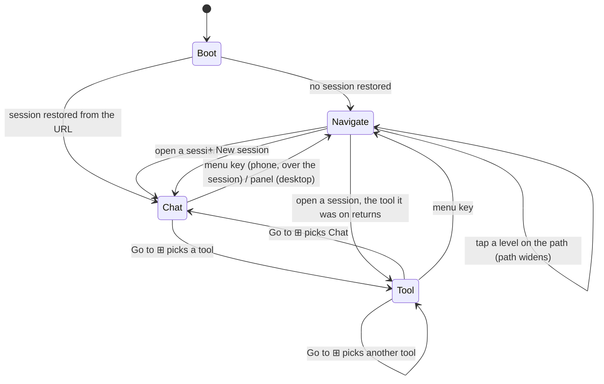
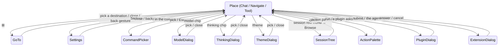
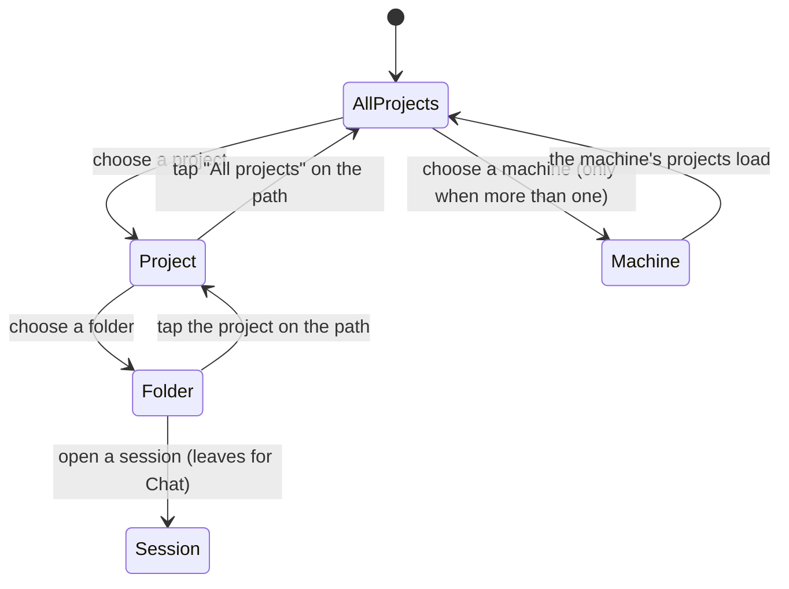

# The navigation state machine

Every surface the reader can be on, every control that moves between them, and
the rule each transition obeys. Written because four navigation surfaces grew
independently and the owner could reach a page with no way back: "各种 machine
project 页面跳来跳去我都不知道怎么回去".

The machine has two layers that must not be confused:

- **Place** — where the reader is: a main view (Chat, Navigate, or a tool) with
  a scope (machine › project › folder › session). Places are addressable: the
  URL restores them.
- **Layer** — what is over the place: one modal at a time (a dialog, a sheet, a
  picker). A layer never changes the place unless the reader picks something in
  it, and closing a layer always returns to the place underneath.

The closure rule this document enforces: **from every state, the reader can
reach every other state without using the browser's back button, and every
layer has a dismissal that returns to the place it opened over.**

## Places

Rules that make the place layer closed:

1. Navigate is reachable from every place through one control: the menu key on
   a phone, the resident panel on desktop.
2. Navigate never dead-ends: narrowing and widening are the same control (the
   path), so the reader can always get back to "All projects".
3. Chat is reachable from Navigate by opening a session, and from a tool by the
   Go to sheet. A tool is never the only way back to anything.
4. A place change writes the URL, so a reload lands on the same place.

## Layers

Rules that make the layer stack closed:

1. At most one layer is open. Opening a second closes the first; the shell's
   modal-layer registry owns that and is what the back gesture reads.
2. Every layer has three dismissals: its own close control, the platform back
   gesture, and Escape on a keyboard.
3. A layer that changes the place (Go to, Navigate's session rows, the tree)
   closes itself as part of the change, so the reader is never left with a
   layer over a place it does not belong to.
4. A layer never opens another place behind itself.

## Scope, which is not a place

Machine, project and folder are scope, not navigation: they narrow what a place
shows. The single mistake this whole rework corrects is treating them as pages.
Scope changes only ever happen inside Navigate, and they never leave it.

## Review: where the machine is not yet closed

| Gap | Where | Status |
| --- | --- | --- |
| Three surfaces still answer "where am I": the context sheet, the quick-access menu and the navigation panel's accordion | `PiWebApp.contextSheetOpen`, `quickSwitcherOpen`, `AppNavigationPanel` | Being retired by `AppNavigatePage`; until they are gone the place layer has three entries where the machine says one |
| A session opened from a remote machine's pins changes machine and place at once | `navigateModel` pinned rows | Allowed by design, but the machine level must show the move, otherwise the path lies about where the session came from |
| The tool places are addressable but the Go to sheet is the only way between them | `AppGoToSheet` | Acceptable: ⊞ is present in every tool and in Chat, so no tool is a dead end |
| Boot with an unreachable machine | route restore | Must land on Navigate with the machine level showing the failure, never on an empty Chat |

## What a change to navigation must prove

1. Name the state it adds or removes in this document.
2. Show the transition into it and the transition out of it, both reachable
   with one control from the place the reader was on.
3. Keep at most one layer open, and keep the back gesture bound to it.
4. Land a probe that walks in and back out again, failing loudly if either
   direction disappears.
