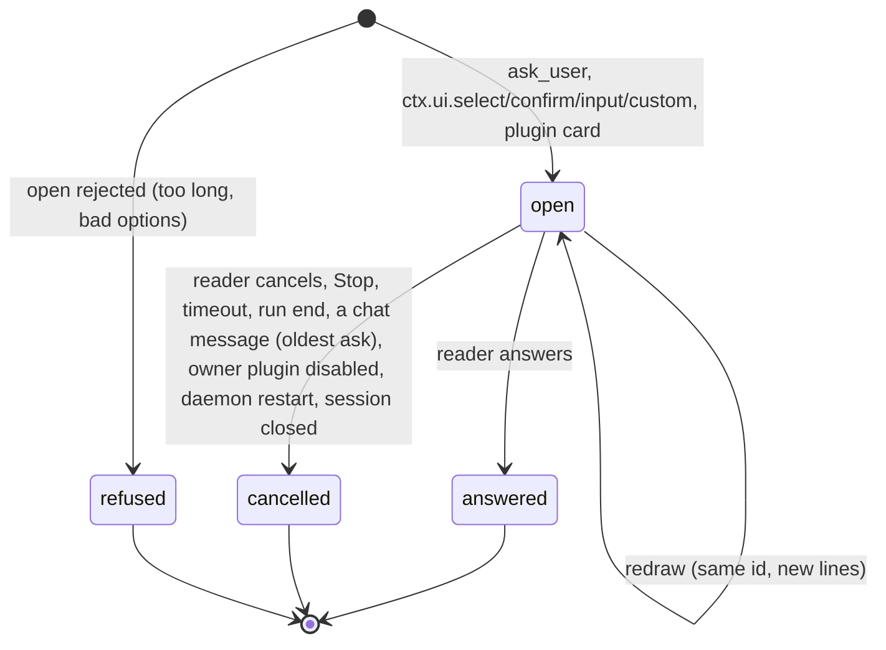
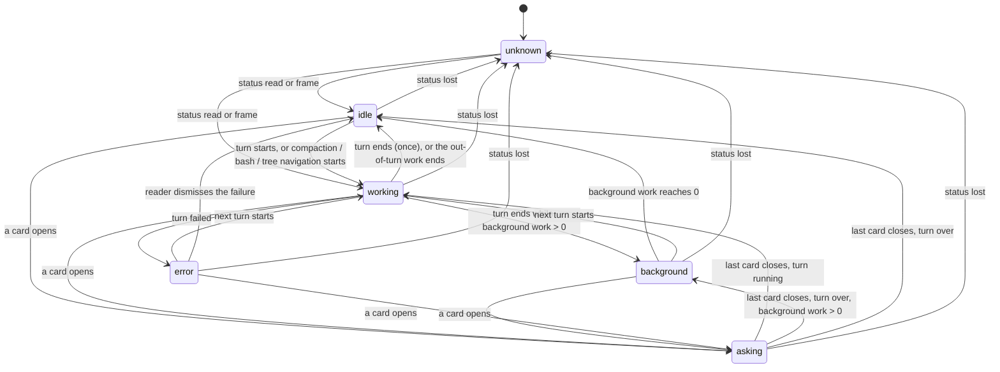
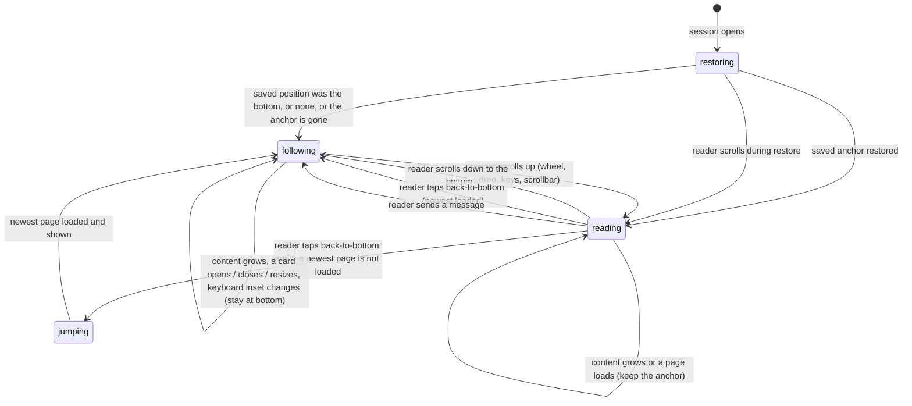
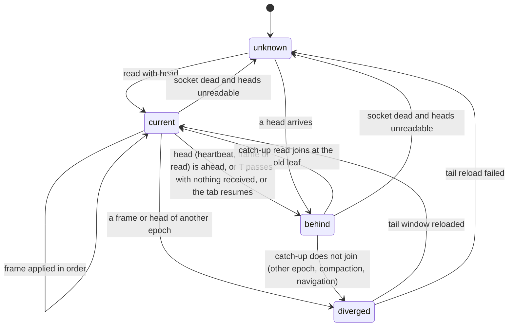
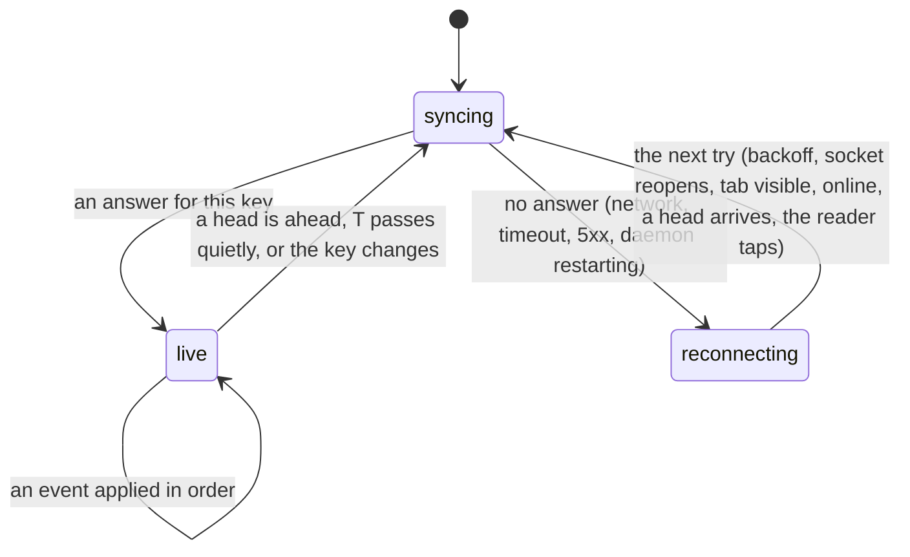
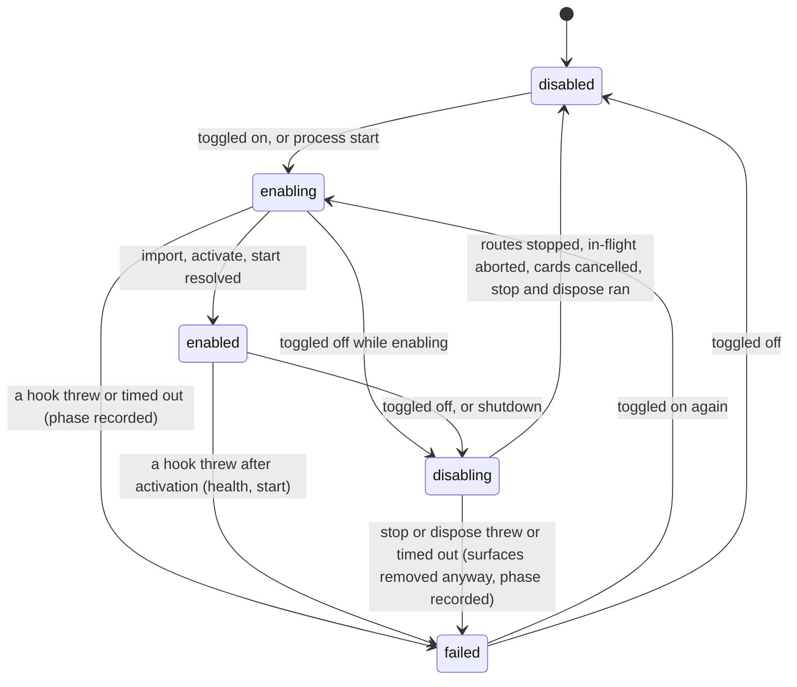
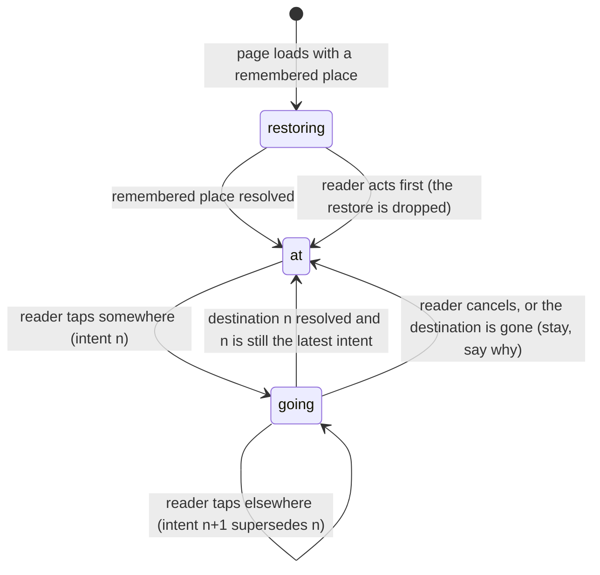
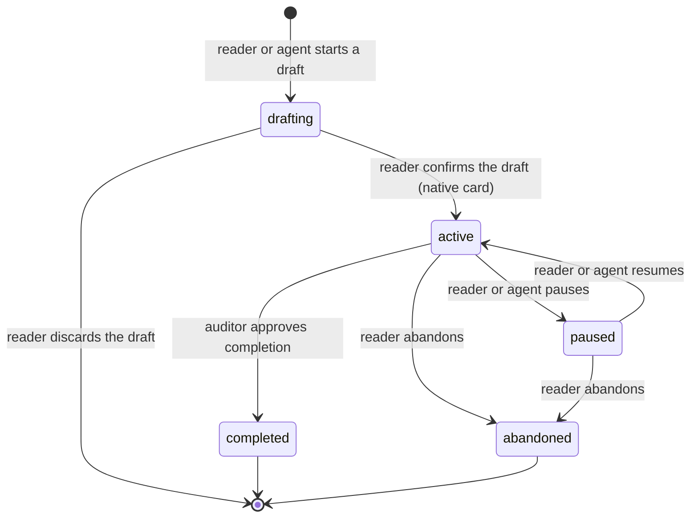

# PI WEB state diagram: one owner per state, every bug on the map

Owner, 2026-09-30: "Use a state-transition diagram. When development hits a new state, judge whether it is reasonable and merge it in, so there is always a global view. Every problem should show on the diagram."

This is the map. Code follows it; it does not follow code.

- **Inventories** (file:line for every claim): workflow run `853ed7cb`, `state-inventory/{messages,status-and-strings,scroll-and-docked-cards,dialogs-sync-socket}.md`.
- **Reviews:** run `e7c7403c`, closure (Opus 5.5) and consistency (DeepSeek 4.1 max). Both are triaged at the end of this document.
- **UI/UX methodology research:** `state-review/uiux-methodology.md`.

## Rules

1. **One owner per state.** Each state has exactly one writer and a fixed set of values. Every other place derives from it; nothing keeps a second copy that can disagree. A cache or a local store is a persistence of the owner's state, not a second state.
2. **Words are output; identity is an id.** A label, a message or an error sentence is rendered from a state and never read back to decide one. Identity crosses a boundary as an id, never as matching text. Typed discriminants (`type`, `kind`, `phase`, `status` fields, exact `customType` constants) are fine. Known debt, each tied to an item here:
   - the commit claim by text (`committedPromptIdentity.ts:39-45`), removed by the `prompt.committed` frame (D1);
   - the pre-ask claim's text fallback (`pendingAskStore.ts:193-198`);
   - the 20 text-decided sites of B16.

   One exception is named and permanent: a scraped terminal screen (the parsed-card fallback). A parse that cannot decide is `unknown` and falls back to the raw frame.
3. **Each transition happens once, and only forward.** Every state has a rank.
   - A fact for a later state applies from any earlier state (skip forward).
   - A fact for an earlier state is ignored, unless it is a named return drawn here.
   - A return keeps the thing's identity and its original times.
4. **Plugins append; they do not own.** A plugin adds information to a fixed core state through a declared contribution point. It never adds a core state and never replaces one. A disabled plugin's appendages disappear, and its open cards are cancelled.
5. **Unknown is a state.** The absence of an answer is `unknown`, never `empty`, `idle` or `current`. A failed read is `unknown` for the source that failed, shown with a retry.
6. **New state, new arrow, here first.** A change that needs a state, a transition or a wire frame not drawn here adds it to this document, with its reason, in the same commit as the code.
7. **PI WEB owns the chrome.** Nothing is injected between the header and the transcript, or between the transcript and the composer. The only exceptions are the status line and the back-to-bottom key (owner, 2026-09-30: "pi web should not support injecting any bar or element here").

## D1. A message (one record per `clientMessageId`)

```mermaid
stateDiagram-v2
    [*] --> sending: reader presses Send (includes a send made before the session backend exists)
    [*] --> queued: another device's or the CLI's message, seen through a frame
    [*] --> committed: a user entry with no clientMessageId (continuations, extension prompts, old history)
    sending --> queued: POST answered (the answer is the acceptance: seq, acceptedAt)
    sending --> unverifiable: no answer (timeout, dropped link, 5xx)
    sending --> notSent: definite refusal (4xx)
    unverifiable --> queued: ledger says accepted
    unverifiable --> committed: ledger says committed
    unverifiable --> consumed: ledger says handled
    unverifiable --> refused: ledger says refused
    unverifiable --> withdrawn: ledger says withdrawn
    unverifiable --> notSent: ledger says never received
    notSent --> sending: Retry (same id)
    unverifiable --> sending: Retry (same id)
    refused --> sending: Retry (same id)
    notSent --> discarded: reader deletes it
    unverifiable --> discarded: reader deletes it
    refused --> discarded: reader deletes it
    queued --> handed: daemon hands the whole queue at an injection point (prompt.handed)
    handed --> queued: pi returned it unread (prompt.returned; same seq, same acceptedAt)
    handed --> committed: pi wrote its user entry (prompt.committed, carries entryId)
    handed --> consumed: pi took it with no user entry, e.g. a handled command (prompt.consumed)
    handed --> queued: daemon restarted before pi wrote its entry (the handed list kept it; B33 commit 2, until then unverifiable)
    queued --> withdrawn: reader recalled it or cleared the queue
    queued --> refused: terminal refusal after acceptance
    handed --> refused: terminal refusal after handoff
    committed --> [*]
    consumed --> [*]
    withdrawn --> [*]
    discarded --> [*]
```

- **Owner.** The daemon owns everything from `queued` on. The browser owns only the states before the daemon knows the message: `sending`, `unverifiable` and `notSent`.
  - The pre-start client queue and the durable outbox are persistences of `sending` and `notSent`, not extra states.
  - There is **one** state per record. The row mark, the pending block and the status queue are all views of it.
- **Wire (new under rule 6).** A frame is how the page learns each daemon arrow. The page never infers a state from an id leaving or entering a list.
  - Existing today: `prompt.accepted`, `prompt.refused`, `prompt.withdrawn`.
  - New: `prompt.handed`, `prompt.returned`, `prompt.committed` (carries `entryId`) and `prompt.consumed`.
  - Every frame carries `seq` and `acceptedAt`. `seq` is a new persisted inbox field, and take-back and `restoreFront` keep it.
  - A duplicate send is answered with the ledger's actual outcome, not always `accepted`.
- **Correlation.** `committed` is a daemon fact. pi writes each message of a handed batch as its own user entry, in order, so the daemon joins entries to the batch by position; text is only a cross-check. On a page rebuild, a pending record whose `clientMessageId` appears on a reloaded entry becomes `committed`, not a second row (this joins D1 to D5).
- **The queue is for waiting, not for pacing** (owner, 2026-09-30).
  - Queued messages are separate items only so the reader can recall one, edit it and send it again.
  - At an injection point (the session accepts steering: a step has ended, or the agent is idle) **every** queued message is handed at once, in `seq` order, as one batch. Each keeps its own row and identity.
  - A recalled message leaves the queue (`withdrawn`) and returns to the composer. Sending it again makes a new message at the tail.
  - **How the idle batch reaches one request (B33).** pi's run polls its steering queue once it has emitted the prompt's own entry, and does not wait for the daemon's listener, which hears of that entry only after the poll. Steers handed once a run has started therefore miss its first request. So at the idle injection point:
    1. the batch is the waiting messages up to the first extension command. A command is its own handoff and ends a batch;
    2. the daemon re-arms `steeringMode = "all"` (a `/reload` resets it), marks the session `handing` so Stop and Clear wait for the batch, and queues the batch's later messages with pi's `session.steer` (skill and template expansion run as for any steer; input handlers run too, but see the message as idle input, since no run has started yet). Each landing is read from the lane's growth, as a running steer's is;
    3. then it starts the run with the oldest;
    4. pi's first poll takes them all, in order, into one request.

    If the oldest is refused, the steers already queued behind it are taken back first, so the batch returns to the inbox in its own order. A known limit: an extension that starts a run of its own between the steers and the oldest's prompt makes the later messages overtake the oldest. The inbox cannot see that window. Until the durable `handed` list (commit 2), the batch's later messages live only in pi's lane while the oldest is in preflight: a recall of one waits for the oldest's handoff, and a Stop or Clear waits for the steers without a bound. A close that cannot wait for the handoff takes them back into the inbox file at once (review b1e7ed02). Measured before the fix (product audit 5d672be6): three queued messages became three requests 16-20 ms apart.
  - **Why holding until a gap cannot batch while the agent runs (B33, measured).** The daemon hears of a gap only after pi polled at it. On a turn with no tool calls, the gap is `turn_end`, and pi's next checks (the loop's steering poll, then `_runAgentPrompt`'s `hasQueuedMessages`) run immediately. The held batch is handed one entry at a time, each awaiting pi's input preflight, so it straddles the final check. A real-SDK test sent B, C and D during a long reply and got three requests: A; then B and C; then D alone, taken back when the run settled.
  - **The mechanism (B33 with B6), after design review 1358db22.** pi's own steering queue is the injection point; pi drains all of it at its next poll. So:
    1. **While the agent runs, one hand per acceptance.** A message is handed to pi's lane when it is accepted. The same holds during an auto-compaction inside a run, because pi re-polls after it. It then waits there, recallable, and pi takes everything waiting at its next poll.
    2. **Two lists, one record.** The inbox file keeps `waiting` messages as today: every existing reader (`take`, `recall`, `clear`, the handoff count, `hasWaiting`, resume) keeps meaning "not yet in pi". It also keeps a separate persisted `handed` list with the full entry and its `seq`. Only three paths touch that list: settle, take-back and restart.
    3. **Settle by position, not by id.** A handed message leaves the `handed` list when pi's run shows its user entry, or shows it consumed, at that message's position. These are the positional facts `directCommitWatchers` and the consumed-steer settle already use. Id matching misses a message that an input handler or template expansion rewrote, and such a record would stick and resurface.
    4. **Take-back keeps the sub-states.** Only a message still in pi's lane returns to `waiting`, at its own `seq`: on recall, Stop, the settle safety net, or a refusal. A message the loop has already drained (G4) stays handed. A recall of a message in the lane splices it out of pi's lane by FIFO position, synchronously, without clearing and replaying the others.
    5. **Restart.** On open, a handed record whose id appears on a branch user entry is dropped: pi committed it. The id is on the persisted entry because the daemon stamps it at `message_start`, before pi appends the entry. Every other record returns to `waiting`. A record without a client id gets a daemon id at acceptance, so this works for every message.
    6. **The status list is the inbox:** `waiting`, then `handed`, ordered by `seq`. pi's lane is never read for it. A steer that entered pi's lane from outside the inbox (an extension) is pi's, not a queued message.

    What the reader sees does not change: queued messages stay listed, numbered, recallable and durable. What changes is that everything waiting reaches the model in one request at the next injection point, which is the owner's rule. A message accepted within the few milliseconds of pi's poll may still land one poll later; that is the only remaining split.
  - **Order of work.** Two commits:
    1. the idle batch. It is a strict improvement on its own, with its own test;
    2. hand at acceptance with the durable `handed` list (the real-SDK test above).

    Rule changes the second flips: `ownedQueue.test` "hands everything waiting at a gap, in order, as steers" and the `promptHandoff.test` table rows for `running` with `nudge` and `gap`.
- **Restart.** A `queued` message survives a daemon restart and stays visible as queued, with its original time. It is handed at the next injection point, so it never "reappears": it never left.
- **Automatic resend.** The outbox resends on reconnect only a `notSent` record made on this device within the last 10 minutes. Anything older stays `notSent` with Retry. An `unverifiable` record is re-asked of the ledger, never blindly resent.
- **Row placement is a function of state**, with exactly one row per id. The transcript tail, from the top:
  1. `committed` rows, at their entries' indices;
  2. the pending block: `queued` and `handed` ordered by `seq`, then `sending`, `unverifiable` and `notSent` ordered by send time;
  3. records of closed cards (D2), in close order;
  4. open cards (D2), FIFO.

  `consumed`, `withdrawn` and `discarded` leave no row; a settled notice appears only where the owner already chose one.
- **Status queue list.**
  - It is ordered by `seq`: the daemon emits it that way, and the lane-by-lane composition (`piSessionService.ts:6409-6420`) goes.
  - It only orders and counts records; it never changes a record's state.
  - Its position is the status stream's `{epoch, seq}` (`statusReadVerdict`).
- **One timestamp that never moves.** A row shows when it was sent: the client's send time when this device sent it, the daemon's `acceptedAt` for a message from elsewhere. It never switches clocks. The commit time is in message info.
- **Words** (owner-approved vocabulary, output only):

  | State | Word |
  |---|---|
  | `sending` | Sending… |
  | `unverifiable` | Receiving… |
  | `notSent` | Not received · Retry |
  | `queued` | Queued · n |
  | `handed` | Received |
  | `refused` | Not accepted · Retry |

## D2. A docked card (asks, extension dialogs, declared screens, plugin cards)

- **Owner.** The daemon's card stores own a card. Cards are session-scoped and FIFO.
- **Cancel causes are typed:** `reader`, `stop`, `timeout`, `run-end`, `reader-sent-message`, `owner-disabled`, `daemon-restart`, `session-closed`. The waiter always resolves, so an extension's `await` never hangs.
- **Class.** `ask_user`, extension dialogs, declared screens and plugin cards are one class.
  - A plugin opens a card through its server half, into the daemon store, with a declared contribution point (`dockedCards`). An answer routes back through the same store.
  - Disabling the plugin cancels its open cards (`owner-disabled`).
- **Rendering.**
  - Every open card renders, FIFO: asks already do, and dialogs follow (no more "N more queued").
  - A card renders once, natively. A declared screen is the Questions card; an undeclared terminal screen is a parsed native option card; the raw frame is the last resort. One question never passes through two cards.
  - A card has exactly one capped inner region, within the waiting slot's 60vh budget. It chains the wheel and touch to the transcript at its end and when it does not overflow; `overscroll-behavior: contain` is for overlays only. The action row never scrolls away.
  - The card re-renders whenever any rendered field changes, including `lines` and `screen`.
- **Placement.** Open cards are the tail of the transcript (D1 order). In D4 `following` they stay in view. In `reading`, an open card below the fold lights the back-to-bottom key with "Waiting for you", whatever the distance. The reader is still never moved.
- **An answer is a message.** Answering a card creates a D1 message:
  - it is `queued` from the moment it is submitted, and its answers record shows in the transcript;
  - it is FIFO with the reader's other messages;
  - it is handed at the next injection point with everything else waiting.

  It never goes into pi's follow-up lane, which waits until the agent has no work left. The same holds for PI WEB's own notices meant for the agent (subsession completion). Measured 2026-09-30: four answers waited 9.5, 10, 26.7 and 14.5 minutes, invisibly (`piSessionService.ts:1997`, `:2688`).
- **A refusal is a state the reader sees.** A refused open files a session notification. It is owned by the notification inbox, scoped to the session, and dismissible. It is never only an error inside the extension.
- **A closed card is inert.** A card kept on screen while a gesture settles has no live handlers. A tap on a card answered elsewhere shows "Answered elsewhere".

## D3. What a session is doing

- **Owner.** One pure classifier (`sessionActivityCategory`) over typed fields: the status booleans, the open cards, the background-work count and the activity `phase`. The chat dock, the session list, the quick switcher and the status line all use it; none has its own ladder.
- **Precedence:** `asking` > `error` > `working` > `background` > `idle`. A question waiting for the reader outranks the failure before it; the failure stays marked on its row.
- **Background work** is a count on the status, contributed by plugins (a `backgroundWork` contribution per plugin, summed by the daemon). The *category* is core. The *words* beside it ("2 background runs", "subagent: reviewing…") are the contributing plugin's appendage. A disabled plugin contributes neither count nor words.
- **Sub-flags** (`compacting`, `bash`) qualify `working`. They are not categories.
- **One `idle` per turn,** published at turn end only. `message_end` inside a turn is not idle.
- **A cut turn settles visibly (B30); every producer.** The reader's Stop is owned by the daemon's `pi-web.turn.stopped` entry. That entry settles as exactly one row, "You stopped this turn", at one of two places:
  1. **On the reply it cut:** a reply pi ended as aborted (or errored with an abort) after the entry. That reply carries the mark (`stoppedBy: "you"`), and its streamed part stays above the row.
  2. **On its own,** when no cut reply follows it before the next user message or the end of the branch. The case: Stop during pi's retry backoff. pi only emits `auto_retry_end {success: false, finalError: "Retry cancelled"}`, and the failed attempt was already hidden as retried. History renders the lone entry as the settled row. Live, the daemon publishes the same row when the stopped work ends with the mark unconsumed: at `agent_end`, or at `auto_retry_end`, because pi schedules a retry after the failed run's `agent_end`.

  Producers enumerated (review run 6cc25868):
  - an `aborted` reply with no row (fixed);
  - a Stop during a direct handoff, which aborts the run the handoff starts but did not record the Stop. The daemon now records it once the handoff's message commits;
  - Stop during retry backoff (case 2 above).

  Everything else that ends a turn without the reader's Stop reads "Interrupted before it finished". This covers `/compact` mid-turn, closing or archiving a session, and a parent-aborted child. It is true in each case. Old history written before the mark reads "Interrupted" by the owner's ruling.
- **Context usage** carries the model and window it was measured against. After a model change it is `unknown` until measured again. It is never capped to hide a wrong number (B24).

### The status line narrates; it never parrots an event word

Owner, 2026-09-30 12:06, after "message queued · 10m 51s" stood while the agent worked and two queued messages waited with no reason given: "Why does this incomprehensible state exist? What the user sees should be a state they understand: what pi web or pi is working on."

The status line answers three questions, every time, from live typed facts:

1. **What is being done right now:** the current **step**, with its object.
   - `thinking`
   - `writing the reply`
   - `preparing a tool call` (tool name and target, once the stream names them)
   - `running a tool` (name, target, elapsed)
   - `compacting`
   - `retrying` (attempt n of m, and why)
   - `waiting for you` (the open card)
   - `idle`
   - plugin appendages beside them
2. **For how long:** the step's elapsed time, and the turn's.
3. **What happens next** to anything the reader waits on. For example, "2 messages will be read when this step finishes" or "waiting for your answer".

The step is a state owned by the daemon, derived from pi's event pairs: `message_update` thinking, text and tool-call deltas; `tool_execution_start`/`end`; retry, compaction and card events. A step ends when its pair closes. It is never kept alive by a heartbeat, and an event word is never shown after its step ended.

## D4. The transcript viewport

- **Owner.** One state (`restoring` / `following` / `reading` / `jumping`) replaces `pinnedToBottom` + `viewportState`.
- **Only reader intent moves it.** Intent means a wheel, a drag that moves, keys, the scrollbar, the back-to-bottom key, or sending a message. A touch that does not move is not intent. A render-time measurement, a programmatic scroll (always tagged as ours), content growth, an image load or a page arrival never moves it.
- **The bottom** is the newest end with the newest page loaded. The bottom of an older window is not the bottom. A reader's downward scroll that lands within 48 px of the bottom counts as reaching it.
- **In `following`,** one writer keeps the bottom through any size change, using a `ResizeObserver` over the content, as `use-stick-to-bottom` does.
- **In `reading`,** nothing moves the reader: no snap on a newer page. Anchor compensation never writes during a gesture in progress.
- **No inline region traps the wheel or a swipe** (see D2).

## D5. Page sync and the socket

- **Owner.** Each surface has a head (docs/design/sync-convergence.md): the transcript `{n, leaf}`, the stream `{epoch, seq}`, and the list and card revisions. The page compares heads and never assumes.
- **Socket:** `connecting` → `open` → `closed`, plus `dead` when nothing at all arrives for 2 × the heartbeat interval.
- **A cached page is a seed,** `unknown` until the first head comparison. A persisted page and its watermark are always written together.
- **Every surface is live** (owner, 2026-09-30: "every screen should take event-based updates at all times"). This covers everything on screen: session rows and their state, latest activity, whether a session waits for the reader, and a list's order.
  - Each surface subscribes to the events that change it and applies them as they arrive.
  - The same quiet window *T* applies: nothing received for *T* makes the surface compare its head and pull only what changed.
  - A session list is ordered by latest activity, a daemon fact carried on the list head. It re-sorts when an activity event arrives, never only when the list is refetched (B28).
- **Efficiency and latency** (owner, 2026-09-30: "guarantee maximal message efficiency and low latency"). The budgets are measured by the phase probes, and a regression fails them:
  - **Latency:** a frame reaches the screen within one animation frame of its arrival. A catch-up after *T* costs one head read plus the missing entries, never a page reload.
  - **Efficiency:** heartbeats and head reads carry heads only, tens of bytes. Status frames carry what changed, not the whole status. Nothing polls on a timer while events are flowing.
- **An aggregate list** (All projects) keeps one state per source. A source that has not answered shows as reconnecting; it never disappears into an empty list.

### A surface never gives up (B48)

Owner, 2026-09-30, on "Couldn't read the projects on this machine." frozen on the phone board: "the page keeps trying to update itself, through event-based messages and, after n silent seconds, an active heartbeat that checks for messages from a newer version … so really there are only two states: trying to reconnect/sync, and syncing … the front end has to design well what it presents to the user".

Measured: 8504 answered both projects reads at 15:21:46 and 15:21:47 with 200 in under 10 ms. The answer was lost on the phone's link, and the page stopped at `projectsLoad: "failed"` with nothing that would read again.

**The rule.** A read that got no answer is not an outcome. A surface is in one of three states, and none of them is final:

- **live**: the surface shows what it knows for its key and applies events as they come. Nothing extra is drawn.
- **syncing**: a read for this key is in flight. Data already known for the same key stays on screen.
- **reconnecting**: the last try got no answer. The surface keeps what it knows for the same key and tries again by itself. Tries back off 1, 2, 4, 8 s, capped at *T* (15 s), and any sign of life (the socket reopening, the tab becoming visible, the browser going online, a head on the keepalive) tries at once.
- **An answer is never "failed".** A server that answered with a refusal has stated a fact, and the fact is shown as itself: 401 opens sign-in, 404 says the project or session is gone. Only "no answer" is reconnecting.
- **Scope.** Retained data belongs to its key (machine + project + workspace + session). On a key change the old data is not shown, and the new key starts at syncing.

**Every producer of a dead end today** (each becomes the three states; none keeps a "failed" of its own):

| surface | today | where |
|---|---|---|
| projects on a machine | "Couldn't read the projects on this machine." / "Projects could not be loaded." | `projectController.ts:51`, `PiWebApp.ts:2701`, `:3158`, `ProjectList.ts:165` |
| workspaces | `workspacesLoad: "failed"`, derived from the global `error` string | `PiWebApp.ts:3206`, `WorkspaceList.ts:201` |
| machines | `machinesLoad: "failed"` | `machineController.ts:33`, `PiWebApp.ts:1254` |
| sessions | `sessionsLoad` | `appState.ts:27` |
| a session's transcript and status | the failure panel with `transcriptFailed` / `statusReadFailed` | `sessionController.ts:506`, `ChatView.ts:1831`, `PiWebApp.ts:4165` |
| opening a session (D8) | "Couldn't open · retry" | `navigationIntent.ts` `OPENING_WORDS.failed` |
| files | "Couldn't read this workspace's files: …" | `files/explorer.ts:89`, `filesPanelElement.ts:134` |
| goals | "Goal records could not …" | `goals/pi-web-plugin.ts:79`, `goalsSectionElement.ts:90` |
| background runs | "This machine could not read the background runs." | `PiWebApp.ts:920`, `backgroundTaskRows.ts:90` |
| subagent runs | "This machine could not be asked for the runs." | `subagents/runsRead.ts:26` |
| interrupted runs | "…the read failed. Reconnect to read it again." | `PiWebApp.ts:259` |
| quick switcher | an empty meaning of kind `failed` | `QuickSwitcher.ts:244` |
| the global banner | "Lost connection…", "A request timed out…", "Connection problem…" | `errorBanner.ts:95-125` |

Plugins read through the host, so the rule reaches them as one host facility: a read the host runs for a panel reports syncing and reconnecting, and retries on the same schedule. A plugin never writes its own retry loop.

**What the reader sees** (owner, 2026-09-30; the full contract is `object-model.md` §0 and §2.3):
- One app-level row, the existing yellow one, shows one claim at a time. A definite failure is not reconnecting, and holds the row until it is dismissed or retired.
- Reconnecting shows only for the machine the reader is using. Another machine, or one project or workspace, that does not answer retries silently.
- A server that answers with an error shows its reason, never "reconnecting".
- Syncing is never visible, except "Loading this session…" during a transcript's first read with nothing known. The tap acknowledgement (row spinner, "Opening…", the progress line) stays. "Still opening…" and the Loading titles go.
- There is no Try now; the page retries by itself. Known data stays live and usable. Other actions fire now and show as pending, and are never replayed.
- A tapped session opens unless it was deleted (the reason, and a way back) or archived (read-only, with Restore).

## D6. A plugin

- **Owner.** The plugin runtime of each process, reconciled against config. A toggle takes effect live (owner, 2026-09-30). In-flight work is aborted.
- For a plugin that runs in both processes, the page shows the worse of the two states (`failed` beats `enabled`) and names the process.
- **Where a plugin shows, and nowhere else** (owner, 2026-09-30: "once a plugin declares it, a new plugin button appears, and tapping it opens the plugin's own custom display"):
  - **A page.** A declared entry in the ≡ Go to page. Tapping it opens the plugin's own page, which the plugin draws.
  - **Appendages to fixed core states:** status-line notes and counts, row actions, docked cards (D2) and a settings page.
  - Nothing else: no bars, strips or drawers over or under the transcript (rule 7). The `drawerSections` contribution point is removed.
- **Global prompts** such as an update offer are machine-scoped. The Updates plugin stores "asked for version v" per machine in its own storage and asks once per machine and version, never once per session.

## D8. Where the reader is (navigation)

- **Owner.** One navigation controller. Every move is an *intent*, stamped with a sequence number from one counter: reader taps, back and forward, boot restore and machine-switch restore all draw from it. An async step commits a visible change only while its intent is still the latest.
- **The frame and its content change together.** The header, the page and everything actionable on it describe the same place at every moment. The previous place's content is never shown, and never actionable, under the next place's frame (owner, 2026-09-30: "it switched but the page content hadn't refreshed, then I kept operating on it… what I operate on is completely out of sync with what is really there"). A seed from the destination's own cache (same key) is allowed; another place's content is not.
- **Producers found (B29), as they were before the fix:**
  1. `openSessionFromQuickSwitcher` closed the Sessions page at tap time, uncovering the *previous* session's chat, live and sendable. It then awaited the machine move and `selectSession` (which returns only after the whole transcript read), and `focusChatComposer` forced the chat view even if the reader had gone elsewhere meanwhile.
  2. `restoreRouteFor` (boot restore, back and forward, machine switch, a terminal's workspace) awaited the machine and plugin loads and then set the view. `routeRestoreSeq` guarded only against a newer restore, not against a reader tap made meanwhile.
  3. The deep link to a fresh session that opens another one (audit P0-1, B31): the restore falls back to a different session while the URL still names the requested one.
  4. Deferred restores: a remote machine or project listing that failed at boot was retried on a timer, and the retry restored the boot route whenever it succeeded, however long after.
  5. A terminal run started with `open: true`, or a workspace removal, opened its terminal after awaited requests, even if the reader had moved on meanwhile.
  6. A second, half-built intent counter (`navigationSelectionSeq`) that only one unused method bumped.
- **Only the reader's intent moves the page.** A late answer to a superseded intent, a background refresh, a restore that the reader already overtook, or a list that reloaded never changes where the reader is (owner, 2026-09-30: "I didn't press anything… it suddenly jumped me to some screen I didn't recognise"; B29).
- **`going` stays in place and says so** (owner, 2026-09-30: "staying in place is fine, but how does the user perceive that they tapped this button?"). The screen stays where it is, live and bound to the place it shows (React Navigation's pending-navigation model). The tap is acknowledged within Nielsen's limits:
  - **within one frame (< 0.1 s):** the tapped item takes its `going` look: the selected highlight, and a spinner in place of its trailing mark, with `aria-busy` and an "Opening <name>" announcement. An indeterminate progress line runs along the top edge of the app. It is chrome-owned, so it stays visible even if the item scrolls away;
  - **after 1 s:** the item's text adds "Opening…";
  - **after 10 s:** the item reads "Still opening…"; going anywhere else cancels it;
  - **on failure:** the item reads "Couldn't open · retry" on its one secondary line (a tile never changes height), and the screen stays;
  - **a destination with a same-key seed** (a cached transcript, a loaded list) switches in the same frame. Only an unseeded destination waits, so the common case never waits;
  - **a tap elsewhere supersedes:** the earlier item returns to normal. A second tap on the same item does nothing, and a tap on a failed item tries again. Back, Escape or closing the list cancels `going` and closes the layer as usual.
- A tap that looks like it did nothing is how a later jump happens; `going` makes every tap visible.
- **Implementation (B29):**
  - One owner, `NavigationIntents` (`src/client/src/navigationIntent.ts`), holds the counter and the pending intent `{seq, key, phase}`. The phase is `going`, `slow`, `stalled` or `failed`, from the pure `navigationPhase(elapsed, failed)` classifier. `OPENING_WORDS` is its text table for the row, and `openingAnnouncement` is the one spoken line, naming the target in every phase.
  - Every reader navigation begins an intent:
    - a view choice (`selectMainView`);
    - opening or leaving the Sessions page;
    - back and forward;
    - closing a layer or the switcher (cancel);
    - a session tap;
    - choosing a project or widening;
    - browsing another machine's tab;
    - choosing or refreshing a machine;
    - New session;
    - opening Settings or Add project from the Sessions page.

    Code that only shows a view on the reader's behalf uses `showView`, which begins nothing, so a restore or a commit never cancels itself.
  - Opening a session:
    1. begin an intent;
    2. if the transcript cache has a seed for the session, commit at once;
    3. otherwise await the first page (`readFirstPage`, stored where selecting looks) and commit only if the intent is still the latest.

    "Commit" is closing the Sessions page and the switcher, showing the chat and selecting the session, in one synchronous step after the machine move, and only while the intent is current. The move goes to the machine the row was read from, whatever tab is showing when the read lands. Focusing the composer happens only inside a current commit. Selecting still reads the page again as it joins the live stream, behind the seeded transcript; B7 removes that second read.
  - `restoreRouteFor` takes the intent current when it was asked for and checks it at every checkpoint. The boot restore captures its intent before its first await and hands the same intent to both deferrals, so a tap made at any point of a flaky boot retires the retry.
  - A terminal run checks, once accepted, that the intent current at its start still is; `openRuntimeTerminal` checks again after restoring the terminal's workspace, and a workspace removal checks before opening its terminal.
  - The chrome draws the progress line from the intent. The tapped row draws its `going` look by comparing its key with the intent's target.
- **A deep link to a session opens that session, or says why it cannot.** It never silently opens another one (audit, B31).

## D7. A goal (our own goal plugin, replacing pi-goal's flow)

- **Focus** is a separate region: `unfocused` ⇄ `focused(session)`.
  - Focusing in another session releases the first one.
  - Focus is released only by a named arrow (focus elsewhere, pause, complete, abandon). A reconcile against a cache it cannot trust yields `unknown`, never a silent release.
  - A report ("created and focused") is derived from the stored state after the write.
- **Continuation** is a region too: `idle` → `waiting-quiescence` (no subagent run or background task active) → `injected`, or `fallback-fired` after a bounded wait.
- **The goal record format belongs to the goal plugin, and so does its reader.** Nothing else parses the files. A file that cannot be read is shown as unreadable, never as "no goals" (B27).

## Methodology folded in (research run `e7c7403c`, `uiux-methodology.md`)

- **Statecharts** (statecharts.dev; Stately testing docs):
  - each domain here is a tagged union, not a set of booleans;
  - the classifier owns events and guards, and components only execute;
  - every domain gets one table-driven test over every (state, event) pair, so an unhandled pair fails CI;
  - nothing the UI must show is a transient state.
- **Nielsen #1, #3, #4, #5** (NN/g):
  - the status line narrates (D3);
  - every mode has a visible exit (selection `✕ Done`, card Cancel, back-to-bottom);
  - one meaning per gesture on both platforms (long press selects; ⋯ is a row's actions; ≡ is navigation);
  - destructive actions are offered only in states where they make sense.
- **Mature chat apps** (Telegram `random_id` and `pts`/`seq`; WhatsApp ticks; iMessage "Not Delivered · Try Again"):
  - reconcile by client id;
  - order by server sequence;
  - a small monotonic ladder of marks;
  - failure as an actionable state on the row (D1).
- **Stick to bottom** (TanStack Virtual end anchoring; use-stick-to-bottom):
  - follow only when pinned;
  - tell user scrolls from ours;
  - keep keyed items in place on prepend;
  - do not rely on CSS `overflow-anchor`, which Safari lacks and many layout changes suppress (D4).
- **Sheets and nested scroll** (Material 3; MDN `overscroll-behavior`):
  - an inline card is a standard sheet, usable alongside the transcript;
  - its height is capped and its body scrolls inside it;
  - `contain` on a region that does not overflow blocks chaining, so it is for overlays only (D2).
- **Selection mode** (Material selection; Android contextual action mode): the contextual bar replaces the top bar; a tap toggles once in the mode; the mode exits on Done, Back or an empty selection, and after an action runs (docs/design/bulk-selection.md). Material prefers undo to confirmation; the owner chose confirmation with a count for Delete permanently, and that stands.
- **Navigation** (NN/g contextual menus and banner blindness; WCAG 3.2.3): the ≡ menu is global navigation, and plugin pages are its entries, in a stable order. Banners are ignored and take space, so none are injected (rule 7).

## Bug index

Every owner report, the domain it breaks, and its producers (file:line in the inventories).

| # | Owner report | Domain | Broken | Producers | Checklist |
|---|---|---|---|---|---|
| B1 | "Queued · 2" drawn above "Queued · 1" | D1 | pending ordered by `seq` | `userMessageRegister.ts:95-124` (source-precedence Map order); `ChatView.ts:1596-1598`; daemon status list composed lane by lane (`piSessionService.ts:6409-6420`); `restoreFront` at the head (`:3220`) | p0-message |
| B2 | an earlier message drawn below a later one (it carried a dialog) | D1, D2 | one row, placed by state | `transcriptReconcile.ts:65-86` (waiting rows appended at the end on rebuild); `userMessageRegister.ts:119-121` | p0-message |
| B3 | a consumed message still reads "Queued" | D1 | one state; `committed` and `consumed` are daemon facts; a snapshot never regresses | no `handed`, `committed` or `consumed` frame (`apiTypes.ts:1552-1554`); `messageDelivery.ts:374-380`; `userMessageRegister.ts:115-121`; commit claimed by text (`committedPromptIdentity.ts:39-45`); duplicate send answered `accepted` (`piSessionService.ts:3148-3149`) | p0-message |
| B4 | old messages suddenly reappear in the queue | D1 | a return keeps identity and times; automatic resend bounded | outbox replay (`PromptEditor.ts:1208-1246`, `pendingOutbox.ts:387-391`); `carryUnsettledForward`; take-back fallback re-mints `acceptedAt` (`piSessionService.ts:3518`); restart hand-off not shown as queued | p0-message |
| B5 | one message, two timestamps | D1 | one timestamp that never moves | `messageDelivery.ts:45` versus `:419-426` | p0-message |
| B6 | a message shown twice; states not strict | D1 | one authority | S1/S2/S8 are three authorities; no committed-entry join on rebuild | p0-message |
| B7 | a long-open page keeps hours-old rows until a reload | D5 | head compared; tail loss detected | the heartbeat `head` has no client consumer; delta replay from a stale persisted page (`sessionController.ts:1688-1734`, `:1768`) | sync |
| B8 | the All-projects list shows only pins | D5 | one state per source | `PiWebApp.ts:2855-2875` | sync |
| B9 | a terminal screen first, the native card only after Close | D2 | one native card per question | host lacks `piWebScreens` (unreleased since `.28`); `openCustomScreen` mounts the TUI (`piSessionService.ts:2127-2168`); pi-goal falls back to `select` | native-screens |
| B10 | "dialog title exceeds its length limit", invisible to the reader | D2 | a refusal is visible | `pendingExtensionDialogStore.ts:108, 300-307`; pi-goal's fallback title | native-screens |
| B11 | the wheel over a card scrolls nothing | D2, D4 | one inner region that chains | `ExtensionDialogCard.ts:514-527, 695`; `AskUserCard.ts:613-619` | native-screens |
| B12 | a special message pushes the ask card down; the reader has to scroll | D4, D2 | only reader intent releases `following` | render-time unpin `ChatView.ts:1107`; untagged programmatic scrolls `:2714`, `:2725-2726`; four writers | native-screens |
| B13 | the view jumps while the reader is above | D4 | nothing moves a reader | snap on a newer page (`viewportDecision.ts:110`); prepend settle during a gesture (`ChatView.ts:2890-2906`) | native-screens |
| B14 | the dock says working while the session is idle | D3 | one classifier; labels are output | `ChatView.ts:1942-1970, 3024` | p0-message |
| B15 | activity flaps between idle and working within a turn | D3 | one `idle` per turn | `piSessionService.ts:5558` | p0-message |
| B16 | state decided by comparing text (20 sites) | all | words are output; identity is an id | status-and-strings inventory, Scope B | maintenance |
| B17 | "Goal created and focused" but nothing is focused | D7 | a report derives from stored state; focus released only by a named arrow | `pi-goal/goal-drafting.ts:384-397`; `goal-state.ts:421`; `storage/goal-files.ts:53`; `goal-service.ts:292-303` | own-goal-plugin |
| B18 | the update prompt pops up in every session | D6 | global prompts are machine-scoped | pi-updater's per-session `session_start` prompt | updates |
| B19 | a plugin toggle needs a restart and leaves the plugin on the page | D6 | toggles are live | `serverRestartRequired`; `registry.disposePlugin` never called | plugin-lifecycle |
| B20 | core counts subagent runs | D3, D6 | the background count is plugin-contributed | `backgroundRunCount.ts:72-101` | plugin-lifecycle |
| B21 | a custom-screen redraw may not repaint | D2 | the rendered state equals the owner's | `askCardIdentity.ts:43-54` omits `lines` and `screen` | native-screens |
| B22 | a closed card is still tappable | D2 | a closed card is inert | `ChatView.ts:1821-1824` (`heldWaiting`) | native-screens |
| B23 | the Goals plugin draws a banner bar over the transcript; two header bars | D6, rule 7 | plugins show only as Go to page entries and appendages | `drawerSections` (`plugins/types.ts:375`), rendered by `ChatView.renderTopDrawer` (`ChatView.ts:1465`) | plugin-surfaces-goto |
| B24 | the context meter reads "ctx 291.5%" after a model change | D3 | usage carries its model; a mismatch is `unknown` | context usage measured against another model's window (to trace) | sync |
| B25 | "message queued · 10m 51s" while the agent works; queued messages wait with no reason | D3 | the status line narrates the step and what comes next | activity label published once at acceptance (`piSessionService.ts:3178`) and re-published by the heartbeat (`:5415-5431`) | p0-message |
| B26 | an ask answered long ago appears only now | D1, D2 | an answer is a queued message, handed at the next injection point | `submitAsk` → `sendCustomMessage(…, { deliverAs: "followUp" })` (`piSessionService.ts:1995-1997`); subsession notices likewise (`:2688`) | p0-message |
| B27 | "No goals in this workspace" while a goal is active | D7, rule 5 | the goal plugin owns its format; an unreadable file is not "none" | pi-goal appends a `# Goal Prompt` section after the JSON; `pi-web-plugins/goals/server-plugin.ts:31-40` parses the whole file as JSON, counts both as broken, and the page says "No goals" | own-goal-plugin |
| B28 | the All-projects session list is not ordered by latest activity, or is stale | D5 | every surface is live; list order comes from a daemon activity fact carried on the list head | the machine-wide list is fetched once and cached for `QUICK_SWITCHER_REFRESH_MS` (`PiWebApp.ts:2820-2826`), not event-driven; order is `modified` at fetch time | sync |
| B29 | the page jumps to another screen with no tap from the reader | D8 | only reader intent navigates; superseded or overtaken intents never move the page | to trace: late navigation completions and restores (`PiWebApp` selection paths, boot restore) | sync |
| B30 | a manual Stop gives no feedback: no message, no status, straight to idle | D1, D3 | a Stop is a visible settled outcome whatever it cut | the "You stopped this turn" row (`af070d94`) is unreleased; on main a Stop that cuts no reply (during a tool call, before any text) leaves no row, and the status shows `idle` without saying why | p0-message |
| B31 | a URL naming a new session shows another session, with live actions | D8, D5 | a named session opens or says why not | boot restore falls back to another session while the URL keeps the requested id (audit 5d672be6) | navigation |
| B32 | streamed text is not shown until the turn ends | D1 | a streaming reply is one row growing in place | seen with the fixture provider only; to verify on a real provider | p0-message |
| B33 | queued messages are handed one per request | D1 | batch handoff at the injection point | three requests 16-20 ms apart (audit fake.log) | p0-message |
| B34 | the final model error is raw JSON | D1 | an error is a sentence plus Details | `Model response failed: 500: {...}` | p0-message |
| B35 | phone targets under 44 px | rule: coarse floor | hit areas at the floor | 22, 24 and 36 px targets (three audit lanes) | maintenance |
| B36 | a queued row has two near-identical take-back keys | D1 words | one take-back action | Recall and Put back side by side | p0-message |
| B37 | a top-level menu is missing from some screens | D8 | every screen reaches Go to and Settings | no Go to on the board, no Settings in a phone chat | navigation |
| B38 | a failed plugin toggle leaves a contradictory card | D6 | a failed save reverts and says why | EACCES on a read-only config; card says "Desired enabled" beside an unticked box | plugin-lifecycle |
| B39 | the Actions palette has no touch opener | D8 | every surface reachable by touch | `actions.show` is the only opener | navigation |
| B40 | permanent delete uses `window.confirm` | chrome | the app's own dialog | `PiWebApp.ts:2742` | bulk |
| B41 | the URL does not describe the Sessions board | D8 | a place survives a reload | stale `tool=` and no `view=` | navigation |
| B42 | `#` search has no suggestions and misses shown states | - | tags are discoverable | only three derived tags | maintenance |
| B43 | Archived hides at 0 and sits seven screens down | bulk | a stable home for Archived | group removed when empty | bulk |
| B44 | phone board chrome takes 20 % of the screen | D4 | owner: keep as it is | 171 px pinned | closed |
| B45 | desktop first boot says "Select a project" beside a populated list | D8 | the empty centre says what to do next | `workspacePanelEmptyState` | navigation |
| B46 | the board's grid key is a no-op | D8 | a key does something or is absent | `aria-pressed` with no effect | navigation |
| B47 | `machineSections` is never rendered | D6 | render it or remove it | no caller of `getMachineSections` | plugin-lifecycle |
| B48 | a read that got no answer freezes a surface at "Couldn't read…" | D5 | a surface is live, syncing or reconnecting, never failed; it retries by itself | `projectsLoad: "failed"` and twelve siblings (D5 table) | sync |
| B49 | a pinned session in a closed project vanishes from PINNED, and a link to it lands on the board | D8 | pins are global and outlive projects: PINNED is resolved from the pinned ids by the daemon, tapping opens the session without reopening its project, closing a project says nothing about pins, and global and project pins are two separate kinds (owner, 2026-09-30) | PINNED is built from the open projects' lists; the pin stays in `session-pins.json` | live-surfaces |
| Fixed | Enter picking an IME word sent the message | composer | the IME owns its key | fixed in `3c449543` | done |
| Fixed | the row menu did not fold on a second tap; no Archive or Delete | menus | one transition per tap | fixed in `a97f6c60` | done |

## Review triage (2026-09-30)

Two lanes reviewed the first draft: closure (Opus 5.5, **FAIL**, all fixes documentary) and consistency (DeepSeek 4.1 max, **PASS WITH FIXES**). Every finding is recorded here, with what was done.

### Closure lane (Opus 5.5)

| Finding | Verdict | Disposition |
|---|---|---|
| F1 `handed` is a dead end for commands and rewritten prompts | true | **Fixed.** Added `consumed` (from `handed` and `unverifiable`), `committed` as a daemon fact through `prompt.committed`, and `[*] → committed` for entries without an id. The text claim is listed as rule-2 debt. |
| F2 duplicate, out-of-order and post-restart cells | true | **Fixed.** Rule 3 now has forward ranks and skip-forward; the ledger answers from `unverifiable`; `[*] → queued`; `handed → unverifiable` on restart; the duplicate reply carries the ledger outcome. |
| F3 `handed` and the return are unobservable | true | **Fixed.** New frames `prompt.handed`, `prompt.returned`, `prompt.committed` and `prompt.consumed`, each with `seq` and `acceptedAt`. The status list never changes state. The position is `{epoch, seq}`. |
| F4 `superseded` contradicts FIFO and the code | true | **Fixed.** Removed. The real trigger, a chat message closing the oldest ask, is a typed cancel cause. |
| F5 D2 missing close events; no plugin-card point | true | **Fixed.** Typed cancel causes, including `owner-disabled`, `daemon-restart` and `session-closed`; the waiter always resolves; a `dockedCards` contribution point through the plugin's server half. |
| F6 D3 drops `background`; `error` has no exits; out-of-turn work | true | **Fixed.** `background` drawn, with a plugin-contributed count; precedence asking > error > working > background > idle; error exits added; compaction, bash and navigation added. |
| F7 D7 is not a state machine | true | **Fixed.** D7 drawn with lifecycle, focus and continuation regions, from the owner's AGENTS.md definition. |
| F8 B24 not closed; capping would hide it | true | **Fixed.** Usage carries its model; a mismatch is `unknown`; capping is rejected. |
| F9.1 `refused` is retryable in code | true | **Fixed.** `refused → sending: Retry`. |
| F9.2 no discard exit | true | **Fixed.** `→ discarded`. |
| F9.3 automatic replay versus Retry | true | **Fixed (decided).** Automatic resend only for `notSent` records of this device under 10 minutes old; `unverifiable` records are re-asked, not resent. |
| F9.4 `queued` × daemon restart | true | **Fixed.** Queued survives, stays visible, and is handed at the next injection point. |
| F9.5 client-queued sends unmapped | true | **Fixed.** They are a persistence of `sending`. |
| F9.6 B4 citation partly stale | true | **Fixed.** Cited as the fallback path (`:3518`). |
| F10 transcript tail order undefined; dialog multiplicity | true | **Fixed (decided).** Tail order stated in D1. Every open card renders FIFO. |
| F11 D4 matrix gaps | true | **Fixed.** `restoring` exits, `jumping`, the definition of the bottom, sending a message as intent, no compensation during a gesture, a still touch is not intent. |
| F12 D5 gaps | true | **Fixed.** `current → diverged` on a new epoch, `diverged → unknown`, per-source state for aggregates, tab resume. |
| F13 D6 gaps | true | **Fixed.** `disabling → failed`, `enabling → disabling`, `enabled → failed`, the two-process rule, the B23 rule in the body, and B18's per-machine store. |
| F14 rule 2 correlation exceptions | true | **Fixed.** Named as debt in rule 2. |
| F15 refusal notice lifetime; "answered elsewhere" | true | **Fixed.** A session notification (owner, scope, dismissal); "Answered elsewhere" on a stale tap. |
| Suspicion: heartbeat budget drift | false | No change. |
| Suspicion: FIFO by seq conflicts with lanes | false | No change: every entry is `lane: "steer"`. |

### Consistency lane (DeepSeek 4.1 max)

| Finding | Verdict | Disposition |
|---|---|---|
| P1-1 `background` missing, yet called an appendage | true | **Fixed.** The category is core; the count is plugin-contributed; the words are the plugin's appendage. |
| P1-2 frames that do not exist; `acceptedAt` and `seq` not on the wire | true | **Fixed.** Named as new under rule 6: the frames, `acceptedAt` on frames and queue entries, and `seq` as a persisted inbox field. |
| P1-3 D2 and D6 both own a plugin card | true | **Fixed.** The store owns the card until it settles; disabling cancels it (`owner-disabled`). |
| P1-4 no join between `clientMessageId` and entry id after a rebuild | true | **Fixed.** `prompt.committed` carries both keys; on rebuild a pending record found on a reloaded entry becomes `committed`. |
| P2-5 `superseded` versus FIFO | true | **Fixed** (same as F4). |
| P2-6 "no nested scroller" versus the card's 60vh budget | true | **Fixed.** One capped inner region that chains at its end; `contain` for overlays only. |
| P2-7 FIFO has no daemon-side producer | true | **Fixed.** The daemon emits the list in `seq` order; the composer and `restoreFront` added to B1. |
| P2-8 an off-screen card in `reading` is invisible | true | **Fixed.** It lights the back-to-bottom key with "Waiting for you"; the reader is not moved. |
| P2-9 `{epoch, revision}` is a third ordering owner | true | **Fixed.** The status position is `{epoch, seq}`; revisions are for cards and lists. |
| P2-10 the timestamp moves and mixes clocks | true | **Fixed (decided).** Client send time for this device's sends, `acceptedAt` otherwise; it never switches. |
| P2-11 error versus asking precedence | true | **Fixed.** asking outranks error. |
| P3-12 `received` and the other browser stores unnamed | partly true | **Fixed differently.** The POST answer is itself the acceptance, so it enters `queued`; the word "Received" maps to `handed`. The pre-start queue and the outbox are persistences, not states. |
| P3-13 rule 2 versus the parsed screen | true | **Fixed.** The named permanent exception, with `unknown` falling back to the raw frame. |
| P3-14 D6 never states where plugin content lives | true | **Fixed**, and superseded by the owner's 2026-09-30 ruling: pages as Go to page entries, appendages, docked cards; no bars (rule 7). |

### Decisions taken here (the owner may override any)

1. A message's shown time is the client send time for this device's sends, and `acceptedAt` otherwise.
2. Automatic resend only for `notSent` records of this device under 10 minutes old.
3. Every open card renders, FIFO.
4. Sending a message is reader intent: the view follows.
5. Precedence: asking > error > working > background > idle.
6. The pre-owner "Received" word maps to `handed`.
