# PI WEB state diagram: one owner per state, every bug on the map

Owner, 2026-09-30: "Use a state-transition diagram. When development hits a new state, judge whether it is reasonable and merge it in, so there is always a global view. Every problem should show on the diagram."

This is the map. Code follows it; it does not follow code.

- **Inventories** (file:line for every claim): workflow run `853ed7cb`, `state-inventory/{messages,status-and-strings,scroll-and-docked-cards,dialogs-sync-socket}.md`.
- **Reviews:** run `e7c7403c`, closure (Opus 5.5) and consistency (DeepSeek 4.1 max). Both are triaged at the end of this document.
- **UI/UX methodology research:** `state-review/uiux-methodology.md`.

## Rules

1. **One owner per state.** Each state has exactly one writer and a fixed set of values. Every other place derives from it; nothing keeps a second copy that can disagree. A cache or a local store is a persistence of the owner's state, not a second state.
2. **Words are output; identity is an id.** A label, a message or an error sentence is rendered from a state and never read back to decide one. Identity crosses a boundary as an id, never as matching text. Typed discriminants (`type`, `kind`, `phase`, `status` fields, exact `customType` constants) are fine. Known debt, each tied to an item here:
   - the commit claim by text (`committedPromptIdentity.ts:39-45`), removed by the `prompt.committed` frame (D1);
   - the pre-ask claim's text fallback (`pendingAskStore.ts:193-198`);
   - the 20 text-decided sites of B16.

   One exception is named and permanent: a scraped terminal screen (the parsed-card fallback). A parse that cannot decide is `unknown` and falls back to the raw frame.
3. **Each transition happens once, and only forward.** Every state has a rank.
   - A fact for a later state applies from any earlier state (skip forward).
   - A fact for an earlier state is ignored, unless it is a named return drawn here.
   - A return keeps the thing's identity and its original times.
4. **Plugins append; they do not own.** A plugin adds information to a fixed core state through a declared contribution point. It never adds a core state and never replaces one. A disabled plugin's appendages disappear, and its open cards are cancelled.
5. **Unknown is a state.** The absence of an answer is `unknown`, never `empty`, `idle` or `current`. A failed read is `unknown` for the source that failed, shown with a retry.
6. **New state, new arrow, here first.** A change that needs a state, a transition or a wire frame not drawn here adds it to this document, with its reason, in the same commit as the code.
7. **PI WEB owns the chrome.** Nothing is injected between the header and the transcript, or between the transcript and the composer. The only exceptions are the status line and the back-to-bottom key (owner, 2026-09-30: "pi web should not support injecting any bar or element here").

## D1. A message (one record per `clientMessageId`)

```mermaid
stateDiagram-v2
    [*] --> sending: reader presses Send (includes a send made before the session backend exists)
    [*] --> queued: another device's or the CLI's message, seen through a frame
    [*] --> committed: a user entry with no clientMessageId (continuations, extension prompts, old history)
    sending --> queued: POST answered (the answer is the acceptance: seq, acceptedAt)
    sending --> unverifiable: no answer (timeout, dropped link, 5xx)
    sending --> notSent: definite refusal (4xx)
    unverifiable --> queued: ledger says accepted
    unverifiable --> committed: ledger says committed
    unverifiable --> consumed: ledger says handled
    unverifiable --> refused: ledger says refused
    unverifiable --> withdrawn: ledger says withdrawn
    unverifiable --> notSent: ledger says never received
    notSent --> sending: Retry (same id)
    unverifiable --> sending: Retry (same id)
    refused --> sending: Retry (same id)
    notSent --> discarded: reader deletes it
    unverifiable --> discarded: reader deletes it
    refused --> discarded: reader deletes it
    queued --> handed: daemon hands the whole queue at an injection point (prompt.handed)
    handed --> queued: pi returned it unread (prompt.returned; same seq, same acceptedAt)
    handed --> committed: pi wrote its user entry (prompt.committed, carries entryId)
    handed --> consumed: pi took it with no user entry, e.g. a handled command (prompt.consumed)
    handed --> queued: daemon restarted before pi wrote its entry (the inbox file's handed list kept it; B33)
    queued --> withdrawn: reader recalled it or cleared the queue
    queued --> refused: terminal refusal after acceptance
    handed --> refused: terminal refusal after handoff
    committed --> [*]
    consumed --> [*]
    withdrawn --> [*]
    discarded --> [*]
```

- **Owner.** The daemon owns everything from `queued` on. The browser owns only the states before the daemon knows the message: `sending`, `unverifiable` and `notSent`.
  - The pre-start client queue and the durable outbox are persistences of `sending` and `notSent`, not extra states.
  - There is **one** state per record. The row mark, the pending block and the status queue are all views of it.
- **Wire (new under rule 6).** A frame is how the page learns each daemon arrow. The page never infers a state from an id leaving or entering a list.
  - Existing today: `prompt.accepted`, `prompt.refused`, `prompt.withdrawn`.
  - New: `prompt.handed`, `prompt.returned`, `prompt.committed` (carries `entryId`) and `prompt.consumed`.
  - Every frame carries `seq` and `acceptedAt`. `seq` is a new persisted inbox field, and take-back and `restoreFront` keep it.
  - A duplicate send is answered with the ledger's actual outcome, not always `accepted`.
- **Correlation.** `committed` is a daemon fact. pi writes each message of a handed batch as its own user entry, in order, so the daemon joins entries to the batch by position; text is only a cross-check. On a page rebuild, a pending record whose `clientMessageId` appears on a reloaded entry becomes `committed`, not a second row (this joins D1 to D5).
- **The queue is for waiting, not for pacing** (owner, 2026-09-30).
  - Queued messages are separate items only so the reader can recall one, edit it and send it again.
  - At an injection point (the session accepts steering: a step has ended, or the agent is idle) **every** queued message is handed at once, in `seq` order, as one batch. Each keeps its own row and identity.
  - A recalled message leaves the queue (`withdrawn`) and returns to the composer. Sending it again makes a new message at the tail.
  - **How the idle batch reaches one request (B33).** pi's run polls its steering queue once it has emitted the prompt's own entry, and does not wait for the daemon's listener, which hears of that entry only after the poll. Steers handed once a run has started therefore miss its first request. So at the idle injection point:
    1. the batch is the waiting messages up to the first extension command. A command is its own handoff and ends a batch;
    2. the daemon re-arms `steeringMode = "all"` (a `/reload` resets it), marks the session `handing` so Stop and Clear wait for the batch, and queues the batch's later messages with pi's `session.steer` (skill and template expansion run as for any steer; input handlers run too, but see the message as idle input, since no run has started yet). Each landing is read from the lane's growth, as a running steer's is;
    3. then it starts the run with the oldest;
    4. pi's first poll takes them all, in order, into one request.

    If the oldest is refused, the steers already queued behind it are taken back first, so the batch returns to the inbox in its own order. A known limit: an extension that starts a run of its own between the steers and the oldest's prompt makes the later messages overtake the oldest. The inbox cannot see that window. While the oldest is in preflight, a recall of one of the later messages waits for the oldest's handoff, and a Stop or Clear waits for the steers without a bound. A close that cannot wait for the handoff takes them back into the inbox file at once (review b1e7ed02). Measured before the fix (product audit 5d672be6): three queued messages became three requests 16-20 ms apart.
  - **Why holding until a gap cannot batch while the agent runs (B33, measured).** The daemon hears of a gap only after pi polled at it. On a turn with no tool calls, the gap is `turn_end`, and pi's next checks (the loop's steering poll, then `_runAgentPrompt`'s `hasQueuedMessages`) run immediately. The held batch is handed one entry at a time, each awaiting pi's input preflight, so it straddles the final check. A real-SDK test sent B, C and D during a long reply and got three requests: A; then B and C; then D alone, taken back when the run settled.
  - **The mechanism (B33 with B6), after design review 1358db22.** pi's own steering queue is the injection point; pi drains all of it at its next poll. So:
    1. **While the agent runs, one hand per acceptance.** A message is handed to pi's lane when it is accepted. The same holds during an auto-compaction inside a run, because pi re-polls after it. It then waits there, recallable, and pi takes everything waiting at its next poll.
    2. **Two lists, one record.** The inbox file keeps `waiting` messages as today: every existing reader (`take`, `recall`, `clear`, the handoff count, `hasWaiting`, resume) keeps meaning "not yet in pi". It also keeps a separate persisted `handed` list with the full entry and its `seq`. Only three paths touch that list: settle, take-back and restart.
    3. **Settle by position, not by id.** A handed message leaves the `handed` list when pi's run shows its user entry, or shows it consumed, at that message's position. These are the positional facts `directCommitWatchers` and the consumed-steer settle already use. Id matching misses a message that an input handler or template expansion rewrote, and such a record would stick and resurface.
    4. **Take-back keeps the sub-states.** Only a message still in pi's lane returns to `waiting`, at its own `seq`: on recall, Stop, the settle safety net, or a refusal. A message the loop has already drained (G4) stays handed. A recall of a message in the lane splices it out of pi's lane by FIFO position, synchronously, without clearing and replaying the others.
    5. **Restart.** On open, a handed record whose id appears on a branch user entry is dropped: pi committed it. The id is on the persisted entry because the daemon stamps it at `message_start`, before pi appends the entry. Every other record returns to `waiting`. A record without a client id gets a daemon id at acceptance, so this works for every message.
    6. **The status list is the inbox:** `waiting`, then `handed`, ordered by `seq`. pi's lane is never read for it. A steer that entered pi's lane from outside the inbox (an extension) is pi's, not a queued message.

    What the reader sees does not change: queued messages stay listed, numbered, recallable and durable. What changes is that everything waiting reaches the model in one request at the next injection point, which is the owner's rule. A message accepted within the few milliseconds of pi's poll may still land one poll later; that is the only remaining split.
  - **Order of work.** Two commits:
    1. the idle batch. It is a strict improvement on its own, with its own test;
    2. hand at acceptance with the durable `handed` list. **Shipped.** A real-SDK test sends B, C and D during A's reply. Before: A; then B and C; then D alone. Now: A; then B, C and D in one request.

    **What the second changed:**
    - `promptHandoff`: `running` answers `steer`. What woke the inbox no longer enters the decision; `HANDOFF_WAKE_EVENTS` only says when to decide again.
    - The inbox file keeps `{ entries, handed }`. `take` moves a message to `handed` in the same write. `settleHanded` is called from `settleSucceeded`, `refuse` and `withdraw`, the three ways a handed message ends. `restoreFront` moves a message back.
    - A message sent without an id gets a daemon `inboxId`, so its local hold id (`entryKey`) survives the file.
    - The restart rule (`returnHanded`) applies only to a handed list read from the file. A list this process kept itself belongs to a runtime whose settle paths are live. A real-SDK run caught the failure: a reopen of the live session returned the message being answered, and pi read it twice.
    - The status list still composes the inbox and pi's lane. B6 makes the inbox its only source. Until then, a lane entry is matched to its held-steer record by position, as every other reader of the lanes does, and is listed while its record is held. Only an entry no record accounts for (one an extension pushed) is checked against the transcript's text. Deciding by text had hidden every repeat of an earlier message ("continue") for the rest of the run.
    - **At most once for a command.** An extension command writes no user entry, so a restart could not tell whether it ran. It leaves the handed list before it is handed: a daemon that dies while its handler runs loses it rather than running it twice.
    - **Ended before the restart.** The ledger is written synchronously and the inbox file after it. A handed message whose ledger row had already settled (withdrawn, refused or read) is dropped at the restart and keeps its outcome. Only one found on the transcript is settled read.
    - Accepted: a message sent without an id that pi read in the moment before a crash runs again (before B33 it was lost), and so does one an input handler consumed.

    **What the tests learned:** many tests parked messages in the inbox by faking a running agent. A running agent now takes each message at once, so tests of what waits in the inbox park through a compaction instead: a running agent that is compacting, the state in which the inbox waits.
- **Restart.** A `queued` message survives a daemon restart and stays visible as queued, with its original time. It is handed at the next injection point, so it never "reappears": it never left.
- **A send to a session that no longer exists** (owner, 2026-10-01: "如果是就直接报错啊在上面"). The session was deleted on another device, by the pi CLI, or by hand on the disk while this page still showed it, so the machine answers the send with the not-found code. It is a definite refusal: no row stays, the words go back to the composer, and the notice at the top says "This session no longer exists, so your message was not sent.", in the words of the session's own page (D8). The code decides it, never the daemon's text ("Session not found"). A shell line and a command say the same, in the notice and in the line or command row they leave in the transcript; their words are not handed back. The code comes from the session's own store, read through its own cwd, so it is an answer about that session; a session moved to another store by a changed `sessionDir` reads as gone here, as its open then says through the machine-wide locate.
- **Automatic resend.** The outbox resends on reconnect only a `notSent` record made on this device within the last 10 minutes. Anything older stays `notSent` with Retry. An `unverifiable` record is re-asked of the ledger, never blindly resent.

  **Built (B4, 2026-10-02).** The composer's replay of everything (on `online`, on the first render, on a session switch) sent every record that stopped without an answer, whatever its age, so a message stranded hours before came back the next time the page loaded, and an unverifiable one was resent blindly. Measured on 8505 (`probe-outbox-stale.mjs`, phone): records two hours old, one not sent and one unverifiable, both reached the daemon on page load. `replaysRecord` now sends by itself only a record not sent (never attempted, such as one kept for its own session while the composer showed another, or failed before its bytes left), within ten minutes of its send time, and not refused; the reader's Retry sends the record it names, whatever its state or age. The ledger's "not received" answer marks the outbox record as not sent too (`failPendingPrompt`), so within the window it goes by itself at the next replay; it usually arrives after the reconnect's own replay, so that is the next session switch or render. A message kept for its own session while the composer showed another is marked not sent at once, so its words, the session list's mark and the replay agree (review bd7a6a81). The daemon side keeps identity and times on a return of its own messages: `restoreFront` puts the original entries back at the head in their order. One path still mints a fresh `acceptedAt`: `takeBackHeldMessages` (when the runtime goes idle, on a recall while it does not run, and at teardown) also takes a steer or follow-up that entered pi's lane from outside the inbox (an extension's), which has no record of ours, into the inbox as a steer with the time of the take-back, and the status then lists it as queued. This rule says such a steer is pi's; whether it should be taken back at all is open (no report traced to it yet).
- **Row placement is a function of state**, with exactly one row per id. The transcript tail, from the top:
  1. `committed` rows, at their entries' indices;
  2. the pending block: `queued` and `handed` ordered by `seq`, then `sending`, `unverifiable` and `notSent` ordered by send time;
  3. records of closed cards (D2), in close order;
  4. open cards (D2), FIFO.

  `consumed`, `withdrawn` and `discarded` leave no row; a settled notice appears only where the owner already chose one.

  **Built (B2, 2026-10-02).** One producer reproduced the "earlier message drawn below a later one" deterministically: a message the daemon still listed as queued left its transcript slot for the pending block below every settled row, while a later message still being sent, or one whose send could not be verified, kept its slot above it. `placeUserRows` (`userRowPlacement.ts`) now places every row by state: a message the agent took at its transcript index; every other one in the pending block, what the daemon lists first, in its order, then every other one (accepted but no longer listed, being sent, unverifiable, not sent) by send time. Measured on 8505 (`probe-row-order.mjs`, phone): before, a message whose send could not be verified was drawn above the queued message sent before it. Review 1b6f1553 found two more producers of the same symptom. A command row issued after the last settled message was drawn above every waiting message; it is now placed among them by issue time, the rule the settled groups already use (measured: `/session` typed after two waiting messages was drawn above both). A committed copy replaced the bubble it claimed in place, so a failed message retried after more conversation jumped back above the replies since its first try, where a reload never drew it; a copy that claims a bubble still open, or a failed one retried, now lands at the end, where pi wrote the entry. Live, a cut send stays unverifiable through the turn and keeps the tail, so that jump is pinned by a unit test, not the probe. Verifying that found one more: once the turn ended, the command sat above the bash run it was typed during and above the message sent before it, because a command went before the first group stamped later than it, and the stamps do not rise steadily (a tool group carries the time it ended, a committed message the time it was sent). A command now goes after the last group stamped at or before it, so nothing that happened before it is drawn below it. The audit's suspected producer, a rebuild while an extension dialog held a message's handoff, cannot reorder messages: the inbox hands nothing else while a handoff waits, and a rebuild's carried rows are placed by state like any other.
- **Status queue list.**
  - It is ordered by `seq`: the daemon emits it that way, and the lane-by-lane composition (`piSessionService.ts:6409-6420`) goes.
  - It only orders and counts records; it never changes a record's state.
  - Its position is the status stream's `{epoch, seq}` (`statusReadVerdict`).
- **One timestamp that never moves** (B5). A message shows the time its sender sent it, on every device and after every reload:
  - The composer sends its send time (`sentAt`) with the message: the time its bubble already shows, and for an outbox retry the time the record was written. The daemon keeps it, clamped to its own acceptance time so a phone clock running fast cannot put a message after the reply to it. A message with an id but no send time (a browser older than this) takes the daemon's `acceptedAt`. A message without a sender id (the pi CLI, an extension) has no committed copy the daemon can claim, so it keeps pi's time and its echo carries none. The inbox file keeps it across a restart, and a message taken back to be handed again keeps it.
  - The daemon stamps that time on the acceptance echo and on pi's committed copy, at the throat that already stamps the `clientMessageId`. pi persists that object, so history reads the same time from the session file.
  - Handing the message to pi later (a held batch, compaction, a restart) never rewrites it.
  - Producers found: pi builds the user message, and its timestamp, when the daemon hands it over, and the committed copy replaced the bubble's meta with it (12:23:49, :50 and :51 all became 12:24:04, audit `5d672be6` P2-3); the browser drew its own clock until the committed copy landed, by tens of milliseconds and more on a skewed phone (`probe-message-rows.mjs`), while every other device drew pi's.
  - The one move left is the sender's own row when its clock runs ahead of the daemon's: the clamp brings it back, once, to the daemon's acceptance time, and every other device shows that time from the start (review `38ec77cc`). A clock behind the daemon's is kept as sent.
  - An outbox retry, automatic or pressed, keeps the time the message was first sent: the row has shown that time all along.
  - The commit time is not shown. If it is ever needed, it belongs in message info, never in the row.
- **Words** (owner-approved vocabulary, output only):

  | State | Word |
  |---|---|
  | `sending` | Sending… |
  | `unverifiable` | Receiving… |
  | `notSent` | Not received · Retry |
  | `queued` | Queued · n |
  | `handed` | Received |
  | `refused` | Not accepted · Retry |

## D2. A docked card (asks, extension dialogs, declared screens, plugin cards)

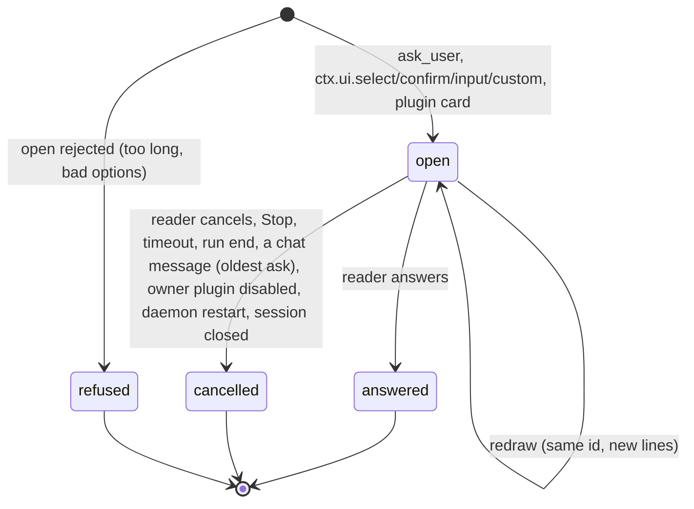

- **Owner.** The daemon's card stores own a card. Cards are session-scoped and FIFO.
- **Cancel causes are typed:** `reader`, `stop`, `timeout`, `run-end`, `reader-sent-message`, `owner-disabled`, `daemon-restart`, `session-closed`. The waiter always resolves, so an extension's `await` never hangs.
- **Run end and Stop settle only what the run opened (B54).** A dialog opened by a tool or an event handler of a run is the run's: its end or a Stop settles it, so the agent loop is never parked behind it. A dialog an extension command opens is the command's, even when the command was typed while a run was going: it outlives that run and closes only by the reader, its timeout or signal, or the session going away. The daemon tells them apart by the async context the dialog opens in (`CommandHandlerScope`), not by `isStreaming`; found 2026-10-02, when a command's screen was settled less than a second after it opened because an unrelated run ended. A run the command itself starts owns its own dialogs once the command's handler has returned.
- **Class.** `ask_user`, extension dialogs, declared screens and plugin cards are one class.
  - A plugin opens a card through its server half, into the daemon store, with a declared contribution point (`dockedCards`). An answer routes back through the same store.
  - Disabling the plugin cancels its open cards (`owner-disabled`).
- **Rendering.**
  - Every open card renders, FIFO: asks already do, and dialogs follow (no more "N more queued").
  - A card renders once, natively. A declared screen is the Questions card; an undeclared terminal screen is a parsed native option card; the raw frame is the last resort. One question never passes through two cards.
  - A card has exactly one capped inner region, within the waiting slot's 60vh budget. It chains the wheel and touch to the transcript at its end and when it does not overflow; `overscroll-behavior: contain` is for overlays only. The action row never scrolls away. Built 2026-10-03 (B11): the dialog detail region declared `contain`, so a wheel over a long goal draft at its end moved nothing (`probe-card-wheel-chains.mjs`); `cardScrollChains.test.ts` keeps vertical containment out of every component drawn in the transcript (horizontal containment on code blocks stays, so a sideways swipe never goes Back).
  - The card re-renders whenever any rendered field changes, including `lines` and `screen`.
  - **Slice a (2026-10-02, owner screenshots).** The reader met an "Extension screen" with "1 more extension dialog queued" under it, and found the native card (an update prompt) only after Close. Done here:
    - Every open dialog renders, FIFO, each answerable on its own (the daemon keys answers, keys and cancels by `dialogId`). The "N more queued" line is gone.
    - An undeclared screen that parses as a menu is a native choice card: its own first line as the heading, the options as radio choices starting on the component's own cursor, Confirm and Cancel. Confirm walks the component's cursor to the chosen option and presses Enter. No hint line, no key row, no monospace frame. Owner ruling (2026-10-02): an extension chooses how its screen is drawn by declaring it (today a declared screen is the Questions card); an undeclared menu defaults to radio choices with Confirm. The first build drew option buttons that selected on tap; the owner chose the radio default from the two prototypes.
    - A screen that does not parse keeps its lines and the key row: the last resort. Its close control reads Cancel, as on every other card.
    - The 8505 test fixture (`ui-custom-probe`) opened its screen in every 8505 session, 351 times in the current log, so every page the owner checked carried it. It opens now only when a probe asks for it (`/ui-custom-probe`).
- **Placement.** Open cards are the tail of the transcript (D1 order). In D4 `following` they stay in view. In `reading`, an open card below the fold lights the back-to-bottom key with "Waiting for you", whatever the distance. The reader is still never moved.
- **An answer is a message.** Answering a card creates a D1 message:
  - it is `queued` from the moment it is submitted, and its answers record shows in the transcript;
  - it is FIFO with the reader's other messages;
  - it is handed at the next injection point with everything else waiting.

  It never goes into pi's follow-up lane, which waits until the agent has no work left. The same holds for PI WEB's own notices meant for the agent (subsession completion). Measured 2026-09-30: four answers waited 9.5, 10, 26.7 and 14.5 minutes, invisibly (`piSessionService.ts:1997`, `:2688`).

  **Built (B26, 2026-10-02).**
  - *Lane.* An answer, and a subsession notice, is delivered with `deliverAs: "steer"` (`AGENT_NOTICE_DELIVERY`). While a run goes it waits in pi's steering queue and is read at the next injection point, after the tool batch in flight, with the reader's own messages in the same queue. On an idle session it starts a run at once, as before. An answer can never be read before the tool batch it was asked beside ends (`ask_user` called with `bash sleep 25`): that wait is the injection point, and it is now visible.
  - *Order, as far as it holds.* An answer reaches pi's queue when it is given; a reader's message reaches it when its inbox handoff lands. So an answer can overtake a message sent just before it whose handoff is still on its way (or waiting out a Stop or Clear), and a recall replays the surviving messages behind the answers. Known and accepted (review of 4a1bdfd7): the answer is not the reader's typed message, and both are read in the same request.
  - *Queued until read.* The status lists `queuedAnswers`: the answers records still in pi's queues, read off those queues on every status, so nothing kept beside them can disagree. The transcript shows each as its answers record marked Queued, among the reader's pending messages by the time it was given (a message from another device carries no time, so the answer goes after it). When pi reads it, its committed record replaces the queued one in place.
  - *A window.* pi's loop takes the answer out of its queue at the poll and draws it at the next turn's start. In between, the status no longer lists it and the transcript does not hold it yet: one frame normally, but a whole compaction when pi compacts between turns. Known and accepted for now (review of 4a1bdfd7); closing it would mean keeping the answer queued on the page until its record arrives, which leaves a row behind if the runtime dies.
  - *Not recallable.* A queued answer has no take-back, and Clear keeps it. Owner ruling (2026-10-02): no take-back.
  - *Take-back keeps it.* Recall, the idle take-back, Stop and Clear empty pi's lanes to take back the reader's messages. A notice is not the reader's message, so it is put back in pi's steering queue. Only the daemon's own custom types count; another extension's custom message is left to pi.
  - *Stop, close and shutdown write it down.* After a Stop, when the session's runtime closes, and when the daemon shuts down, a notice still queued is written into the transcript without starting a run (`triggerTurn: false`); the agent reads it with its next turn. Only the notices leave the queue: a reader's message steered while the Stop settled stays for the take-back (review of 4a1bdfd7). At close the page gets no live frame for it, because the session's events are already unsubscribed; it is on the transcript the next time the session is read.
  - *Known limit.* A daemon that dies while an answer is queued loses it, as before, because pi's queues live in the runtime. Its queued record then leaves the transcript tail with the status.
- **A refusal is a state the reader sees.** A refused open files a session notification. It is owned by the notification inbox, scoped to the session, and dismissible. It is never only an error inside the extension.
- **A closed card is inert.** A card kept on screen while a gesture settles has no live handlers. A tap on a card answered elsewhere shows "Answered elsewhere". Built 2026-10-03 (B22, `waitingSlotHold`): while a press holds or settles, the cards already drawn keep their places; a card still open is drawn live, a card that closed is drawn inert with no answer, cancel or key handler bound, and a card that opened during the press joins at the end. A closed card is held beside a card still open, and every open form is held, not only the first (review b2c94ee9). A held card's layout is the live card's. The "Answered elsewhere" words wait on the owner (the no-UI ruling).

## D3. What a session is doing

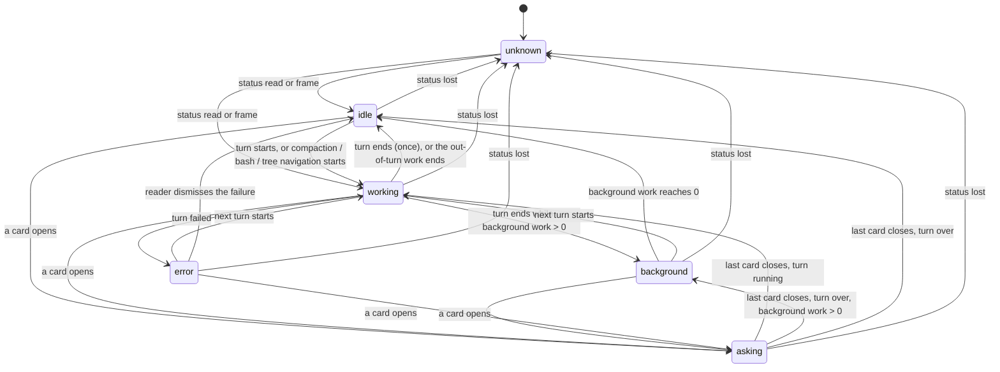

- **Owner.** One pure classifier (`sessionActivityCategory`) over typed fields: the status booleans, the open cards, the background-work count and the activity `phase`. The chat dock, the session list, the quick switcher and the status line all use it; none has its own ladder.
- **Precedence:** `asking` > `error` > `working` > `background` > `idle`. A question waiting for the reader outranks the failure before it; the failure stays in the transcript. (The classifier had `error` first, a leftover of the four-state badge that predates this diagram; it follows this order since the B14 review.)
- **Built (B14, 2026-10-02).** Three derivations had grown beside the classifier, and they disagreed:
  - the chat dock's own ladder (`activityState`) read the activity's *label* when no status had arrived, so a session whose last word was "stopped" showed working dots until its status came; it took "background" from a plugin's note being present rather than from the count, and ignored an active phase the classifier counts;
  - the quick switcher drew its badge from the classifier but its WORKING and waiting groups from `isSessionActive` and `isWaitingForUser`, so a session being opened sat outside WORKING with working dots, and a failed session still streaming sat in WORKING with a red badge;
  - the Go to page's rows knew only waiting, working and idle, from the same two sets, so a failed session and one with background work read idle there while the switcher said error and background.

  Now every surface asks `sessionActivityCategory`. The dock's category is the classifier's, and its words are output only: the step narration (D3), else the activity's words, else the status's own work word; asking says "Waiting for your answer" unless there is work a reader could stop. The switcher's groups and the Go to page's sections are ids in a category, computed once from the same map. The Go to page marks all five categories with the switcher's colours, and a session whose state is unknown carries no mark: absence is not negation.
- **A different question.** `isSessionActive` stays, for a different question: is there work a reader could stop or must wait for (Stop, reload gating, a turn's falling edge, and the workspace roll-up, whose working flag is drawn on the workspace tile and means work a reader could stop below here). A session being opened is shown as working on its own row but has nothing to stop, so it does not light its workspace.
- **Domain** (B14 review). The map covers every session a surface lists: the board's rows, pinned sessions whose project is closed, and the stepped-into project's own sessions. While another machine is browsed, neither the switcher nor the Go to page gets this machine's states: the rows wear no mark.
- **Boot read** (B14). The status catalog a page reads at boot carries each session's latest activity, and the page takes it for a session it knows none for or holds an earlier one for (the daemon stamps both), as a live status does, so a reconnect learns a failure the page missed while its socket was down (review bd7a6a81); the selected session learns from its own status read, which also sets the dock. Before, a page loaded after a session failed never learned it: the Go to page and the switcher said "Session is done" for it, while a page open at the time said "Session hit an error" (`probe-one-classifier.mjs`).
- **Background work** is a count on the status, contributed by plugins (a `backgroundWork` contribution per plugin, summed by the daemon). The *category* is core. The *words* beside it ("2 background runs", "subagent: reviewing…") are the contributing plugin's appendage. A disabled plugin contributes neither count nor words.
- **Sub-flags** (`compacting`, `bash`) qualify `working`. They are not categories.
- **One `idle` per turn,** published at turn end only. `message_end` inside a turn is not idle.
- **A cut turn settles visibly (B30); every producer.** The reader's Stop is owned by the daemon's `pi-web.turn.stopped` entry. That entry settles as exactly one row, "You stopped this turn", at one of two places:
  1. **On the reply it cut:** a reply pi ended as aborted (or errored with an abort) after the entry. That reply carries the mark (`stoppedBy: "you"`), and its streamed part stays above the row.
  2. **On its own,** when no cut reply follows it before the next user message or the end of the branch. The case: Stop during pi's retry backoff. pi only emits `auto_retry_end {success: false, finalError: "Retry cancelled"}`, and the failed attempt was already hidden as retried. History renders the lone entry as the settled row. Live, the daemon publishes the same row when the stopped work ends with the mark unconsumed: at `agent_end`, or at `auto_retry_end`, because pi schedules a retry after the failed run's `agent_end`.

  Producers enumerated (review run 6cc25868):
  - an `aborted` reply with no row (fixed);
  - a Stop during a direct handoff, which aborts the run the handoff starts but did not record the Stop. The daemon now records it once the handoff's message commits;
  - Stop during retry backoff (case 2 above).

  Everything else that ends a turn without the reader's Stop reads "Interrupted before it finished". This covers `/compact` mid-turn, closing or archiving a session, and a parent-aborted child. It is true in each case. Old history written before the mark reads "Interrupted" by the owner's ruling.
- **Context usage** carries the model and window it was measured against. After a model change it is `unknown` until measured again. It is never capped to hide a wrong number (B24).

### The status line narrates; it never parrots an event word

Owner, 2026-09-30 12:06, after "message queued · 10m 51s" stood while the agent worked and two queued messages waited with no reason given: "Why does this incomprehensible state exist? What the user sees should be a state they understand: what pi web or pi is working on."

The status line answers three questions, every time, from live typed facts:

1. **What is being done right now:** the current **step**, with its object.
   - `thinking`
   - `writing the reply`
   - `preparing a tool call` (tool name and target, once the stream names them)
   - `running a tool` (name, target, elapsed)
   - `compacting`
   - `retrying` (attempt n of m, and why)
   - `waiting for you` (the open card)
   - `idle`
   - plugin appendages beside them
2. **For how long:** the step's elapsed time, and the turn's.
3. **What happens next** to anything the reader waits on. For example, "2 messages will be read when this step finishes" or "waiting for your answer".

The step is a state owned by the daemon, derived from pi's event pairs: `message_update` thinking, text and tool-call deltas; `tool_execution_start`/`end`; retry, compaction and card events. A step ends when its pair closes. It is never kept alive by a heartbeat, and an event word is never shown after its step ended.

**Built (B25 and B15, 2026-10-02).** The step is one typed field, `SessionActivity.step`, with `stepSince`, from one pure reducer (`nextSessionStep`, `sessionStep.ts`). The label and detail are derived from it for older readers and are output only.

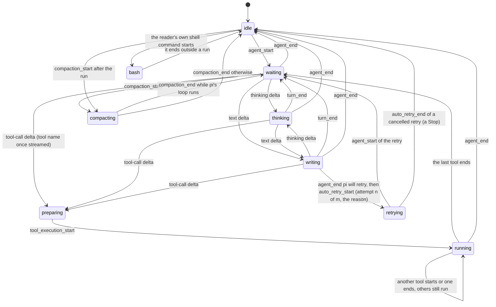

- **States.** `idle`; `waiting` (a request is on its way to the model and nothing has streamed yet); `thinking`; `writing`; `preparing` (a tool call is streaming, with the tool once named); `running` (the tools executing now, each with its name and target, in parallel); `retrying` (attempt, maximum, reason, and when it resumes); `compacting`; `bash` (the reader's own shell command).
- **One idle per turn (B15).** Only `agent_end` (and the end of compaction or of the reader's shell command outside a run) reaches `idle`. `message_end`, `turn_end` and a tool's end no longer publish an idle phase mid-run, and a failed tool is part of the run, not an `error` phase: the turn's own failure is.
- **Other events leave the step alone.** The fallback that re-published "working" for every unrecognised event is gone.
- **Review of ad83d24b.** pi emits `agent_end` before it schedules a retry, with `willRetry`; that `agent_end` keeps the step, so a retried run never shows idle in between, and `auto_retry_end` ends only a `retrying` step (its success arrives mid-reply and changes nothing). "While a run goes" means pi's agent loop is running: a compaction pi starts after the loop ended ends idle. pi emits nothing for the reader's `!` command, so the daemon feeds the reducer that command's start and end itself. The heartbeat's net resets any non-idle step once nothing runs, whatever word was published last. A step on a session that is not working is never narrated.
- **What the step is not.** The phase can still read idle mid-run when the reader changes the model or the thinking level: that is the word of that action, and the step beside it is unchanged. "Waiting for you" is the open card's own state; the card says it, and the dock stays out of its way. The step's time is measured against the daemon's clock, as the turn's is.
- **The dock says the step, its time, and what comes next.** "Thinking · 4 s", "Running bash: sleep 25 · 12 s", "Retrying, attempt 2 of 3: overloaded". When something waits for the agent, the dock says when it is read, from the step: during `thinking`, `writing` and `preparing`, "read when this reply ends"; during `running`, "read when these tools finish"; otherwise "read next". Answers count with messages ("your answer is read when these tools finish"). The words live in one table per step kind.

## D4. The transcript viewport

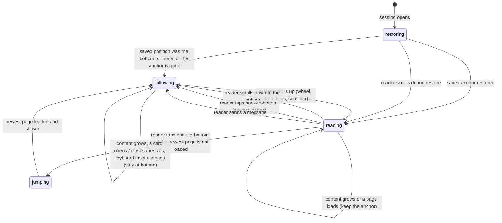

- **Owner.** One state (`restoring` / `following` / `reading` / `jumping`) replaces `pinnedToBottom` + `viewportState`.
- **Only reader intent moves it.** Intent means a wheel, a drag that moves, keys, the scrollbar, the back-to-bottom key, or sending a message. A touch that does not move is not intent. A render-time measurement, a programmatic scroll (always tagged as ours), content growth, an image load or a page arrival never moves it.
- **The bottom** is the newest end with the newest page loaded. The bottom of an older window is not the bottom. A reader's downward scroll that lands within 48 px of the bottom counts as reaching it. An upward scroll that ends at the bottom is not the reader leaving it: a view that grew (the dock or the composer got shorter) lowers `scrollTop` to keep the bottom, and that scroll read as upward, so a docked card's session dropped out of `following` with nobody touching it (B12, built 2026-10-03, `probe-following-keeps-card.mjs`).
- **In `following`,** one writer keeps the bottom through any size change, using a `ResizeObserver` over the content, as `use-stick-to-bottom` does.
- **In `reading`,** nothing moves the reader: no snap on a newer page. Anchor compensation never writes during a gesture in progress. Built 2026-10-03 (B13, `viewportDecision.AFTER_PAGE`): only the jump to the newest moves the reader after a page; a page they scrolled into, older or newer, keeps them reading (`probe-newer-page-holds.mjs`: the seed session's newer page took a reader at the end of an older window 1,658 px down to the bottom). The follow flag ChatView keeps beside the decision obeys the same rule (`followsAfterScroll`): reaching the end of an older window does not pin the reader, so the page landing under them cannot carry them down (review ca45d6ed: a reader who waited at that end was still carried to the bottom). A newer page that lands after the reader pressed the jump lands them at the newest. Scrolling down to the bottom of the newest returns `reading` to `following`.
- **A restore settles.** A restored spot leaves `restoring` for `reading`, and a restore that landed at the bottom of the newest for `following` (`restoreSettled`; the state follows the follow flag, which an older window's end never sets, for a restored and a skipped spot alike). A viewport left in `restoring` asks for no page, so a session reopened where the reader left it loaded nothing however far they scrolled (review ca45d6ed, `probe-failed-page.mjs` leg R).
  - **A restore reads older pages through the decision** and stays `restoring` across them; a spot page that waits out a failed read's hold or is on its way is unknown, not gone, so the restore waits and goes on when the hold ends. Only an older end that is not there lands at the newest. Before, every page after the first went around the decision, so its failure was never held, and one failed read threw the remembered place away within a frame (review 754821b2).
  - **The reader takes over.** A wheel or a touch drag during a restore, or while a jump's page is on its way, ends the restore and makes the page on its way the reader's (`readerTookOver`): it lands without moving them (`restoring --> reading: reader scrolls during restore`).
- **A page read ends, success or failure, and a failure is paced.** A read that fails clears its in-flight mark like one that lands: a newer read that failed stayed "in flight", and since any read in flight holds both ends, neither end loaded again until the transcript changed some other way (leg A). A failure holds both ends on the read ladder (`pageRetry`: 1 s, doubling to the 15 s quiet window, reset by a page that lands), and when the hold ends the viewport asks again from where the reader is. The hold is a state its own timer releases, not a time compared with the wall clock, which can step back. Only the jump asks through the hold; a scroll waits it out (1 s after a first failure, longer only while failures go on), because the update that follows a failure cannot tell the reader's scroll from its own re-evaluation: that re-evaluation asked again at once, so a failing older read repeated about 47 times a second against the daemon while the reader rested at the top (leg B). A jump whose read failed leaves the reader `reading` at the older window's end, where the hold's end asks again (review 754821b2: it left them `following` a window that loads nothing newer).
- **The back-to-newest key asks for the newest page wherever the reader is.** Its read went through the forward end's prefetch distance (1.5 screens), so pressed mid-window in an older window it asked nothing and moved nothing, and the viewport waited on a page nobody had asked for (seen 2026-10-03 on 8505, `probe-jump-far.mjs`: 0 reads, `fromBottom` unchanged at 56,856 px). A newest page that lands short of the newest asks again (the walk is the decision's, not a flag's), and the last one lands the reader at the newest.
- **No inline region traps the wheel or a swipe** (see D2).

## D5. Page sync and the socket

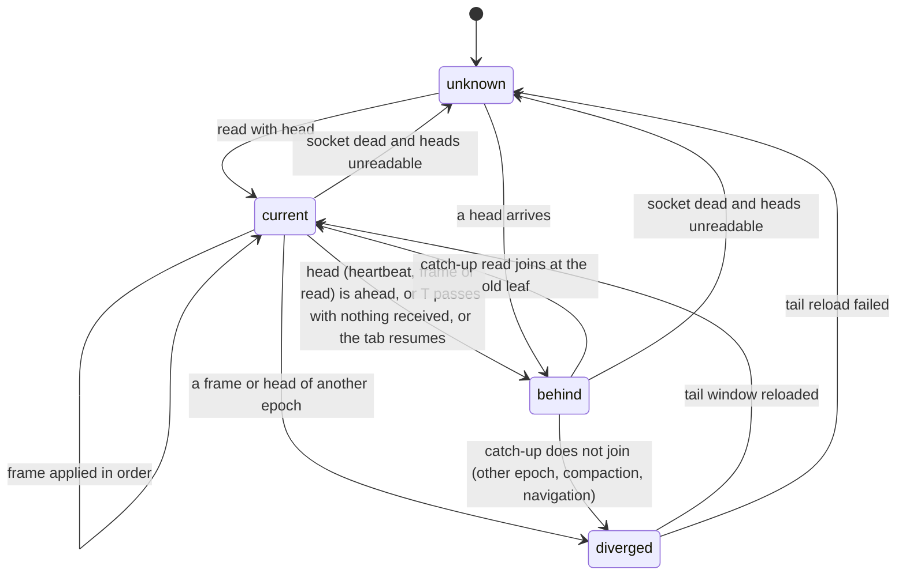

- **Owner.** Each surface has a head (docs/design/sync-convergence.md): the transcript `{n, leaf}`, the stream `{epoch, seq}`, and the list and card revisions. The page compares heads and never assumes.
- **Socket:** `connecting` → `open` → `closed`, plus `dead` when nothing at all arrives for 2 × the heartbeat interval.
- **A cached page is a seed,** `unknown` until the first head comparison. A persisted page and its watermark are always written together.
- **Every surface is live** (owner, 2026-09-30: "every screen should take event-based updates at all times"). This covers everything on screen: session rows and their state, latest activity, whether a session waits for the reader, and a list's order.
  - Each surface subscribes to the events that change it and applies them as they arrive.
  - The same quiet window *T* applies: nothing received for *T* makes the surface compare its head and pull only what changed.
  - A session list is ordered by latest activity, a daemon fact carried on the list head. It re-sorts when an activity event arrives, never only when the list is refetched (B28).
  - **The board takes its machine's announcements** (O-P9). A `session.name` or `session.created` the machine publishes changes that machine's board at once, on the main socket for the selected machine and on its activity socket for any other: a rename renames the row wherever the board lists it, and a new session in one of the board's workspaces joins it. Before, a session renamed or started on another device stayed stale on the board and in the quick switcher until the next whole read. A change that lands while a board read is on its way is applied again over that read's answer, so the older answer never erases it (I13). A fork or a copy is announced as a new session too. An announcement of a session the board already lists keeps the listed row, which is the newer one, and a rename the machine refused is taken back.
  - **Pins outlive projects** (B49 slice a). The board answer also locates each pinned session that no open project lists, so PINNED keeps a pinned session whose project was closed, and tapping it opens the session without opening the project. The page then names no project: a session outside every open project is placed `outside`, which empties the project and workspace selection, and its URL names the session alone, which a reload opens again. While a project has not answered the place is `unknown`, and nothing moves. A pin whose session is gone is not drawn, and is kept: the board's locate starts from the home directory and does not search a project's own configured session directory, so a live session of a closed project can read gone there (review of 4caabf4e, which unpinned on it and destroyed such pins). A deleted session is no longer pinned (owner, 2026-10-01: "删掉了自动就没有了"): PINNED never draws it, and the machine unpins it when PI WEB deletes it. The web process owns the pins and unpins every id its daemon's answer to a delete or a cleanup names as deleted, the only proof of a deletion it sees. A session deleted with the pi CLI or by hand keeps an undrawn pin until a locate can prove it gone (B49 pin kinds: a pin that records its session's cwd). A pin whose locate did not answer keeps the board partial, keeps its pin, and is asked again.
  - **The board is one read** (P4 slice a). A machine's session board (every project's workspaces and every workspace's sessions) is one request, composed by that machine's web process from its own projects, its workspaces and its daemon's listings. Before, the page made 1 + P + W requests through two lanes of its six connections (14 for 6 projects on 8505, 27 or more for 13 on 8504). The answer keeps each source that did not answer as unknown, so a partial board is still a partial board (B48). A machine whose web process predates the route answers 404 or the app shell; the page then composes the board itself, as before, and remembers that for the page's life.
  - **Pins** (P5 slice a). Each machine's pins are read once, then again only when:
    - its realtime socket delivers `pins.changed`, which the web process that wrote a pin nudges its daemon to publish;
    - that socket reopens;
    - the tab resumes.

    A render never reads them. Before, every render more than 2 s after the last read re-read them, which was 7–8 reads a minute with the git panel open and nothing happening. A change that arrives while a read is on its way is read once more after it, and a write that changed nothing announces nothing. A remote machine's pins go through the gateway to that machine's own web process (P5 slice b; before, the gateway had no route for them, so they were never readable there), and its `pins.changed` comes back on that machine's socket.
- **A fact the socket keeps live is read once per socket open** (P6 slice a). A machine's unread set and its pins are kept live by that machine's socket, so the read that counts is the one sent after the socket opened: only a read that leaves after the subscription began can be sure no change fell between its answer and the first event.
  - A need that arises while the socket is still connecting waits for the open instead of reading. The open reads.
  - A socket that has not opened within 1.5 s does not hold the read hostage: the page reads anyway, and the open reads again, since the earlier read cannot prove the gap empty.
  - A machine with no socket at all is read at once. A machine that joins the roster gets its socket before its need is decided, so its socket's open is its one read (review 44fc106b: a remote machine was read on the roster and again at its socket's open).
  - A page's first `pageshow` is the load itself and reads nothing; only a page restored from the back-forward cache reads its unread set again.
  - Before, a boot read each twice, 3 ms apart: once on the first render or the machine roster, and once when the socket opened.
- **A project's workspace deletion runs are read when the selected project changes** (P6 slice a), on its machine, and an answer applies only to the machine and project it was read for. A request made while a read is on its way is read once more after it. Before, they were read on every workspace change and again at the end of a route restore (twice per boot); an answer was checked against the machine alone, so a slow read for one project landed on another; and a request made during a read was dropped. A failed read leaves the runs unknown, not empty, and is tried again on the shared backoff while the project stays selected.
- **Git status** (P5 slice c). The git panel reads its status every 8 s only while the panel is on screen and the tab is visible, and reads at once when it comes back on screen. "On screen" means laid out in the viewport: a sheet or dialog drawn over the panel does not stop the poll (one read too many, never one too few). Before, it read for as long as it was rendered, and the host keeps the active panel rendered while the phone shows the chat (7 reads a minute unseen). A change made while it is off screen still arrives through `workspace.changed`, and a change announced while a read is on its way is read once more after it. The poll itself stays until the workspace has a head and a watch of its own: the daemon watches only the working directories of the sessions it holds open, so a workspace with every session closed has no other freshness (B28).
- **Efficiency and latency** (owner, 2026-09-30: "guarantee maximal message efficiency and low latency"). The budgets are measured by the phase probes, and a regression fails them:
  - **Latency:** a frame reaches the screen within one animation frame of its arrival. A catch-up after *T* costs one head read plus the missing entries, never a page reload.
  - **Efficiency:** heartbeats and head reads carry heads only, tens of bytes. Status frames carry what changed, not the whole status. Nothing polls on a timer while events are flowing.
- **An aggregate list** (All projects) keeps one state per source. A source that has not answered shows as reconnecting; it never disappears into an empty list.

### An open reads the session once (P3 slice c)

Measured on 8505, a cold open of a session whose extension raises a startup dialog: 5 status reads, 5 stream syncs, 1 tail and 4 refreshes of the open session. A warm open (runtime already up) made 1 status and 1 tail. Two producers did it:

- **The dialog surface resynced while its first full read was on its way.**
  - The selection's status read opens the runtime, and that takes seconds.
  - The startup dialog the runtime raises reaches the socket before the read answers.
  - The surface was not fresh yet, so it asked for a full read, and the refresh's trailing request doubled it.
- **Dialog, ask and inbox frames lost their seq in validation.**
  - Their dedicated validators rebuild the event, so the gap repair never saw their seq.
  - The next status frame then looked like a gap, and the repair fetched the range again.

The rules now:

```mermaid
stateDiagram-v2
    [*] --> awaiting: selected (its full read is on its way)
    awaiting --> awaiting: a revisioned frame (remember its revision; apply nothing)
    awaiting --> fresh: the full read answers at or past every remembered revision
    awaiting --> resyncing: the full read answers below a remembered revision, or fails with one remembered
    fresh --> fresh: frame at revision + 1 (apply), or at or below it (ignore)
    fresh --> resyncing: a skipped revision, a resync flag, another daemon
    resyncing --> fresh: the repair read answers
```

- **A surface that is not fresh waits for the read on its way.** Its status read reflects every revision up to the one it reports. Only a frame past that revision proves the read stale. A failed read with a frame remembered resyncs, and a frame after a failed read resyncs at once, since no read is on its way. Any read that answers below a frame that waited for it, the repair read included, asks once more, so a lost frame is never dropped for good. A failed or stale status read, or one whose transcript read beside it failed, still settles the surface: it applies when it answered fresh, and otherwise leaves no read on its way.
- **Every frame of the session's seq space keeps its seq**, the revisioned ones included, so the gap repair sees every frame the socket delivered. A gap is a seq the socket never delivered, nothing else.
- **Only transcript frames are reflected by the transcript snapshot.** A dialog, ask or inbox frame at or below the snapshot's seq still applies, and its own revision scope drops it when it is old. The gap repair uses its seq for order and for the frontier, never to skip it.
- **The budget** (probe `probe-open-reads.mjs`): a cold open with a startup dialog makes 1 tail, 1 status and no stream sync when the stream has no real gap. A warm open does the same.

### Reading a closed session never opens it (P3 slice d)

A session's runtime is opened by an action (a send, a command, a Stop, a model change) or by a read of live runtime state (status, models, thinking levels, commands). A read of what the session holds never opens it: its transcript, a page of it, and its background tasks answer from the session file when no runtime is open. An archived session is read from its archive file, and nothing the page reads to show it opens a runtime.

- **Before:** the background tasks read (on every selection, including archived sessions) and the transcript page read (an archived session's whole open, and every Load earlier) opened the runtime only to learn the file path or the entries. That cost about a second cold, loaded every extension, and showed "Opening session: Loading session extensions" on an archived session that can take no message.
- **Which file:** the archived record's archive file when the session is archived in that directory, else the session file resolved in its directory. Neither means the session is not there (`session-not-found`).
- **Which entries:** a current-version file is read as the SDK reads it (`branchFromFileEntries`). An older file takes the runtime path, which migrates it on disk (P2 slice c).
- **A runtime still closing** can write its last entries (steers it took back, the aborted reply) after it left the active set, so a closed read waits for that close to finish before it reads the file.
- **Proof** (probe `probe-closed-reads.mjs`): an archived copy opened by link never appears in the daemon's runtime catalogue (`sessions/statuses`) and shows no startup notice; a closed live copy's status read opening its runtime is the control.

### The subagents run list: read while watched, poll only while the session works (P3 slice b)

Measured on 8505 before: 40-47 requests a minute with the git or files panel open on an idle session. The run list was read every 3 s for as long as the tab's badge followed a session, and each answer re-rendered the app, which re-read the pins. Until the run list has a head of its own (P4), it keeps a poll, but only while it can change and only while someone looks.

The panel records what it last saw for the session it follows, and decides from that record and the status now:

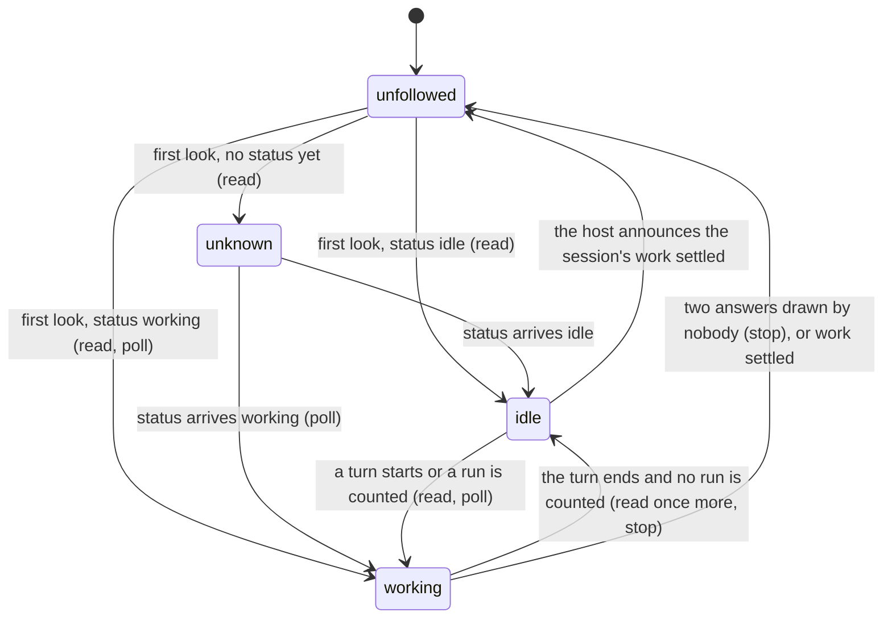

- **Working** means a turn is streaming or `backgroundRunCount` > 0. That count also covers background shell tasks, so a long-running dev server keeps the panel polling while it is on screen (as before this slice); the run list's own head removes that in P4.
- **An unknown status is no news.** It neither starts a poll nor counts as a change, so the read a new selection already makes is not doubled when its status lands.
- **Watched** is observed, not declared. The panel looks when its tab badge is drawn, or when the host draws the panel while it is on screen. The host keeps the active panel rendered while the phone shows the chat, so a render alone is not a look: a zero-height marker in the panel's own template reports, through an IntersectionObserver, whether the panel is shown (`subagents/onScreenMarker.ts`, the git review sections' precedent). Each answer asks the host to draw; two answers with no look in between stop the poll and forget the record. A read still on its way is no evidence, so a stalled read never stops a watched poll. Coming back on screen asks for a render, which reads if the record was forgotten.
- **Work that happened out of sight** is caught by the host's `session-activity-settled`: the plugin forgets its record, and the next look reads. The host announces it when the selected session's turn ends and, since this slice, when the last of its background runs ends while no turn runs (`sessionWorkSettled.ts`). The open workspace tool is refreshed on the same edge.
- **The read on an edge** never trusts a read already on its way, which may predate the edge: `RunsRead.refresh()` reads once more when that read lands. There is still one read in flight at most.
- Measured on 8505 (60 s idle, 1440×900). Before (HEAD `d085e874`): the subagents panel 41 requests a minute, git 47, files 40, chat 1. After: subagents 1, git 14–16 (git status 7 and pins 7–8; the pins go in P5, the git poll to its own head), files 0, chat 0. `probe-subagents-quiet.mjs` at 393×850: HEAD fails 5 of 14 legs, this slice passes 14 of 14.

### Workspace pages stay fresh while someone looks (Files and Git)

The owner asked for Git and Files to refresh by themselves, every few seconds (2026-10-02). Measured first on 8505: a file written from outside showed in both within 2.8 s, through the workspace watcher, and both re-read when a turn or the last background run ends. The gaps were in Files. It had no read of its own, and the watcher is only a hint: it can drop events and it watches only the directories of sessions the daemon holds open. The open file in the viewer was never re-read at all.

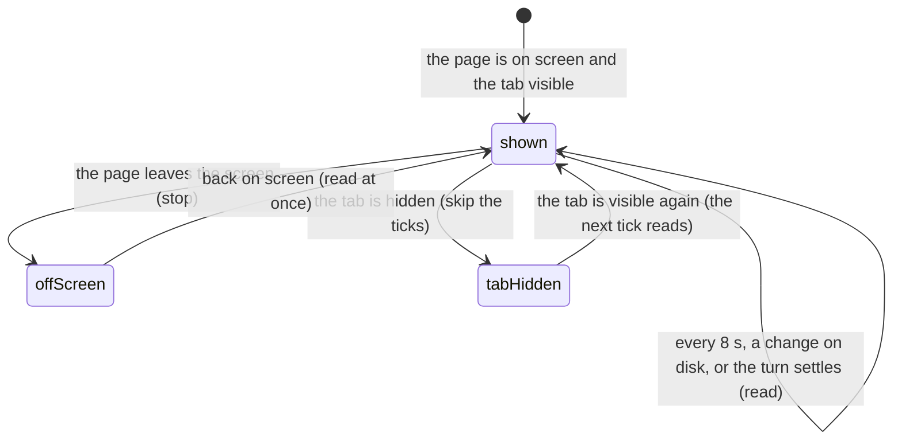

- **Owner.** Each page owns its own read, as Git already did (`GIT_POLL_INTERVAL_MS`, 8 s). Files reads its tree on the same terms: only while its page is on screen and the tab is visible, and at once on coming back on screen. A read keeps the expanded folders and the selection.
- **One read at a time.** A read asked for while one is on its way waits for it and reads once more, as Git's `statusReadAgain` does. Overlapping reads let a machine slower than the interval land nothing at all.
- **"Out of date" goes only for a read that says so.** The toolbar's mark goes when a read lands, for the workspace still shown, and began after the latest settled turn. A failed read, a read for a workspace the reader left, or one already on its way when the turn settled leaves it up; the next read takes it down.
- **A folder that fails to list** keeps what it showed, unless the read shows it gone from its parent, which drops it. An expanded folder the agent deleted used to fail every later read, so the whole tree froze.
- **The open file follows the tree.** Every Files read compares the open file with its entry in the listing it just got (`selectedFileVerdict`):
  - a different `modifiedAt` re-reads it, keeping the old content on screen until the new content arrives;
  - an entry gone from a folder listing the read holds re-reads it too, so the viewer says the file is gone;
  - a folder listing the read does not hold says nothing, and nothing is re-read;
  - a symlink is re-read on every read: its listing reports the link, not the file it points to;
  - an open file whose last read failed is re-read while the listing still shows it, so a failure that passed does not stay on screen; one gone from a held folder is not.
- **The reader keeps their place.** New bytes of the open file land in the editor already showing it, with the selection kept and the line at the top of the view still at the top; another file gets a new editor.
- **Cost.** One listing per held folder every 8 s while Files is on screen, as Git costs one status read. Neither reads while off screen or in a hidden tab. Known extra reads, accepted: an open symlink, an open file whose read keeps failing, and an open file absent from a listing cut at 1000 entries are each re-read once per read; an expanded folder inside a collapsed one is still listed.

### A surface never gives up (B48)

Owner, 2026-09-30, on "Couldn't read the projects on this machine." frozen on the phone board: "the page keeps trying to update itself, through event-based messages and, after n silent seconds, an active heartbeat that checks for messages from a newer version … so really there are only two states: trying to reconnect/sync, and syncing … the front end has to design well what it presents to the user".

Measured: 8504 answered both projects reads at 15:21:46 and 15:21:47 with 200 in under 10 ms. The answer was lost on the phone's link, and the page stopped at `projectsLoad: "failed"` with nothing that would read again.

**The rule.** A read that got no answer is not an outcome. A surface is in one of three states, and none of them is final:

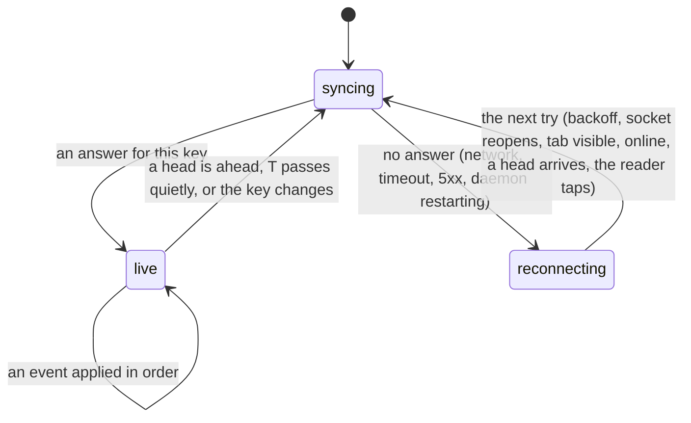

- **live**: the surface shows what it knows for its key and applies events as they come. Nothing extra is drawn.
- **syncing**: a read for this key is in flight. Data already known for the same key stays on screen.
- **reconnecting**: the last try got no answer. The surface keeps what it knows for the same key and tries again by itself. Tries back off 1, 2, 4, 8 s, capped at *T* (15 s), and any sign of life (the socket reopening, the tab becoming visible, the browser going online, a head on the keepalive) tries at once.
- **An answer is never "failed".** A server that answered with a refusal has stated a fact, and the fact is shown as itself: 401 opens sign-in, 404 says the project or session is gone. Only "no answer" is reconnecting.
- **Scope.** Retained data belongs to its key (machine + project + workspace + session). On a key change the old data is not shown, and the new key starts at syncing.

**Every producer of a dead end today** (each becomes the three states; none keeps a "failed" of its own):

| surface | today | where |
|---|---|---|
| projects on a machine | "Couldn't read the projects on this machine." / "Projects could not be loaded." | `projectController.ts:51`, `PiWebApp.ts:2701`, `:3158`, `ProjectList.ts:165` |
| workspaces | `workspacesLoad: "failed"`, derived from the global `error` string | `PiWebApp.ts:3206`, `WorkspaceList.ts:201` |
| machines | `machinesLoad: "failed"`, and a remote deep link whose roster retry ladder stops after five tries | `machineController.ts:33`, `PiWebApp.ts:1254`, `:1569` |
| a deep link to a remote machine | "*m* is still unavailable." after five tries, and the restore is dropped | `PiWebApp.ts:1685`, `:1707` |
| sessions | `sessionsLoad` | `appState.ts:27` |
| a session's transcript and status | the failure panel with `transcriptFailed` / `statusReadFailed` | `sessionController.ts:506`, `ChatView.ts:1831`, `PiWebApp.ts:4165` |
| opening a session (D8) | "Couldn't open · retry" | `navigationIntent.ts` `OPENING_WORDS.failed` |
| files | "Couldn't read this workspace's files: …" | `files/explorer.ts:89`, `filesPanelElement.ts:134` |
| goals | "Goal records could not …" | `goals/pi-web-plugin.ts:79`, `goalsSectionElement.ts:90` |
| background runs | "This machine could not read the background runs." | `PiWebApp.ts:920`, `backgroundTaskRows.ts:90` |
| subagent runs | "This machine could not be asked for the runs." | `subagents/runsRead.ts:26` |
| interrupted runs | "…the read failed. Reconnect to read it again." | `PiWebApp.ts:259` |
| the status of a sent message | a red "Reconnecting to update message status…" notice with Retry, written into `state.error` and retired by comparing that text (owner screenshot, 2026-10-01: "shouldn't this be removed as well?") | `sendVerification.ts` `VERIFY_RECONNECTING`, `sessionController.ts` `askLedgerAbout` |
| quick switcher and the navigation board | an empty meaning of kind `failed`, "Loading sessions…", and "No sessions yet." after a lost projects read; a workspace whose read failed was dropped without a trace | `QuickSwitcher.ts:244`, `AppNavigatePage.ts:279`, `PiWebApp.loadQuickSwitcherData` |
| the global banner | "Lost connection…", "A request timed out…", "Connection problem…" | `errorBanner.ts:95-125` |

**The status of a sent message speaks through the row (P1 slice 6).** A row that says "Receiving…" is asked about on a clock, by asking the daemon's ledger. When an ask gets no answer, that is an unanswered read like any other. It is scoped to the machine and the session, counted from the first ask that got none, and folded into the app's one row with the projects, machines and named-target misses. So it waits out the same grace and shows the same words: "Reconnecting…", "*m* is unavailable; reconnecting…", or a server's own reason. It never shows Retry, and it leaves when an ask gets through, when a later send to the same session is answered (the link to its machine is up), or when the reader leaves the session: leaving ends the episode, so coming back never shows a claim counted from before, which would skip the grace. Nothing about it is written into `state.error`, and nothing compares display text. The message's own row keeps saying "Receiving…" meanwhile. A send nobody answered starts the claim itself, and no longer raises the transport error as a notice: that notice was a second producer of the same words, hidden until now under the first. Still decided by text, though already in the row's style and without Retry: the machine-down notices and the transport rewrites in `errorBanner.ts` (the session daemon, a dropped fetch, a remote machine). They become typed misses with B16.

Done so far: projects on a machine (P1 slice 1); workspaces, and placing a session opened from another project (P1 slice 2); the machines roster, and a deep link to a remote machine, which keeps retrying with the shared backoff while it is still the reader's intent (P1 slice 3); the row names why a read is unanswered (P1 slice 4); the session board across the machine (P1 slice 5); a missing session is a typed fact, `gone`, not an error text (P2 slice a).

**A missing session** (P2 slice a) is one typed answer end to end:

| where | before | after |
|---|---|---|
| daemon | `new Error("Session not found")`; a read route turned any error into 404, a mutation route matched the message text, and an unreadable session directory listed as empty | `SessionNotFoundError`, answered as 404 with `code: "session-not-found"`; any other failure keeps the route's own status (500 for the transcript and status reads, 503 for child-work reads, 400 for mutations); an unreadable directory is a failure |
| wire | `{error}` | `{error, code}`; the text is kept for older clients |
| client | `message.includes("session not found")` | `HttpError.code`; `classifyReadError` gives the fact `gone`, and a 404 without a code is a server error. The text match remains only for a coded-less 404 from an older daemon |

**The session board** (P1 slice 5) is read from many sources: the projects, each project's workspaces, and each workspace's sessions. It answers in three degrees, `BoardAnswer`:
- `none`: nothing answered yet;
- `partial`: rows from the sources that answered, while others did not;
- `complete`: every source answered.

A source that did not answer is kept as unknown and read again on the shared backoff, never dropped; a retry asks only those sources. The list claims only what it knows:

| board | rows match | the list says |
|---|---|---|
| any | some | nothing extra |
| `none` or `partial` | none | nothing: a source may still hold them |
| `complete` | none, with a query | "No sessions match “q”." |
| `complete` | none, narrowed by the path | "No sessions in this part of the path.", with a way to widen |
| `complete` | none | "No sessions yet." |

The board is not a cause for the app row: the row already speaks for the machine's projects and roster, and a single unanswered source retries silently (owner Q4).

Plugins read through the host, so the rule reaches them as one host facility: a read the host runs for a panel reports syncing and reconnecting, and retries on the same schedule. A plugin never writes its own retry loop.

**What the reader sees** (owner, 2026-09-30; the full contract is `object-model.md` §0 and §2.3):
- One app-level row, the existing yellow one, shows one claim at a time. A definite failure is not reconnecting, and holds the row until it is dismissed or retired.
- Reconnecting shows only for the machine the reader is using. Another machine, or one project or workspace, that does not answer retries silently.
- A server that answers with an error shows its reason, never "reconnecting". Why a read went unanswered is one typed value (`ReadMiss`, object model §2.3):

  | miss | the row says |
  |---|---|
  | `link-down`: no status, or a 502/503/504 that PI WEB's gateway did not claim | "Reconnecting…" |
  | `machine-unanswering(m)`: a 502/503/504 whose body names a remote machine (the gateway) | "*m* is unavailable; reconnecting…" |
  | `server-error(m, reason)`: any other status | "*m*: *reason*" |

  All three keep retrying and retire when an answer comes; only a fact (401, 403) stops the retries.
- Syncing is never visible, except "Loading this session…" during a transcript's first read with nothing known. The tap acknowledgement (row spinner, "Opening…", the progress line) stays. "Still opening…" and the Loading titles go.
- There is no Try now; the page retries by itself. Known data stays live and usable. Other actions fire now and show as pending, and are never replayed.
- A tapped session opens unless it was deleted (the reason, and a way back) or archived (read-only, with Restore).

### A lost announcement is noticed (B28 slice H1)

Every surface stays live from the machine's announcements on its global socket: unread, pins, statuses, a session's name, a new session. The socket can stay open and still lose one: a proxy drops a frame, a send fails on a full buffer, a debug drop. Before this, nothing noticed it.
- Global frames already carry one increasing `seq` per daemon, and the page counted the gaps but did nothing with them.
- A frame lost last, before a quiet stretch, was not even counted: no later frame revealed it.
- So a pin, a rename or an unread mark stayed wrong until the socket reopened or the page was reloaded.

```mermaid
stateDiagram-v2
  [*] --> baseline: socket opens (the join frame carries the current seq)
  baseline --> current: a frame with seq n+1, or a keepalive whose head is n
  current --> current: the next frame in order; a keepalive whose head equals the last seq
  current --> missed: a frame whose seq skips, or a keepalive whose head is ahead
  missed --> current: the page reads again what the socket keeps live
  current --> [*]: socket closes (the next open is a new baseline)
```

- **The baseline is the join frame's `seq`.** Without it the first frame after an open set the baseline, so losing that frame went unseen.
- **The keepalive carries the global head.** A global socket's keepalive is sent after 20 s with nothing else on it. It now says `{ type: "keepalive", head: { seq } }`, the last `seq` the daemon stamped, so a frame lost last is noticed within one keepalive. It costs a few bytes, and no request.
- **Missed means read again.** The page then re-reads, for that machine, what its frames keep live: unread, pins, its machine status (projects and workspaces ride it), and its board. The board the page follows (the last one browsed) is read whole at once; another machine's is read whole the next time it is shown. On the machine in use it also re-reads the statuses, the workspace's sessions, its terminals and its open workspace panels. A status frame applied while that read was on its way is kept: the frame is the later fact. An "active" activity the read shows is over is dropped, because a lost `activity.update` is never published again.
- **One pass at a time.** A burst of losses on a lossy link shares one pass of reads and asks for at most one more after it. One lost frame costs these reads once, and lost frames are rare. Per-surface heads are not kept, until a measurement says these reads cost too much.
- **A reopen is a miss too** (B28 slice H2). Everything announced while no socket of the page was open for a machine was lost: during a reconnect, and for one handshake when a machine switch hands the machine from one of its sockets to the other. An open is a miss when the page has heard that machine before, whichever socket it was; it then reads again what a miss does (above), plus the interrupted runs. So a session renamed or created, or a file changed, while the page was offline shows without a reload. The page's first open of a machine is not a miss: the boot reads that machine's board once already (`loadQuickSwitcherData`). Open workspace panels follow the same visibility rule as a live `workspace.changed`: a hidden tab refreshes them when it comes back.
- **A frame applied during a read wins.** A replacing status read keeps any status frame and any activity frame applied while it was on its way, on one frame clock. It also keeps the activity of a session this page is still starting, which no catalog can list yet.
- **An older daemon** sends neither the join `seq` nor the head. The page then falls back to what it did before: gaps between frames are noticed, and a lost last frame is not.
- **A session's own frames** already have this: a ring of frames and a gap repair that replays them (D5, "Stream").
- **Fault injection:** `probe-missed-announcement.mjs` drops one global frame between the daemon and the page (Playwright's `routeWebSocket`), on any build.

## D6. A plugin

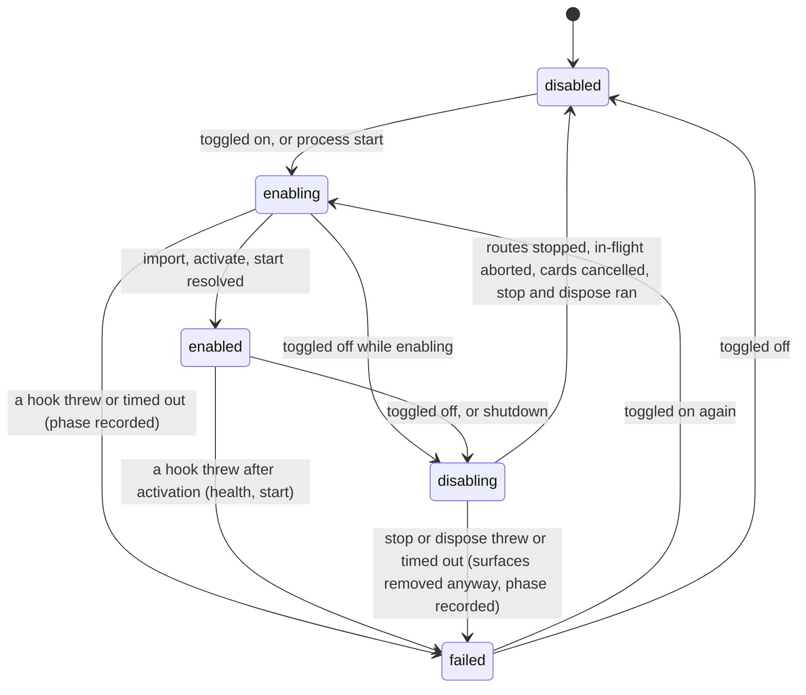

- **Owner.** The plugin runtime of each process, reconciled against config. A toggle takes effect live (owner, 2026-09-30). In-flight work is aborted.
- For a plugin that runs in both processes, the page shows the worse of the two states (`failed` beats `enabled`) and names the process.
- **Where a plugin shows, and nowhere else** (owner, 2026-09-30: "once a plugin declares it, a new plugin button appears, and tapping it opens the plugin's own custom display"):
  - **A page.** A declared entry in the ≡ Go to page. Tapping it opens the plugin's own page, which the plugin draws.
  - **Appendages to fixed core states:** status-line notes and counts, row actions, docked cards (D2) and a settings page.
  - Nothing else: no bars, strips or drawers over or under the transcript (rule 7). The `drawerSections` contribution point is removed.
- **Global prompts** such as an update offer are machine-scoped. The Updates plugin stores "asked for version v" per machine in its own storage and asks once per machine and version, never once per session.
- **A page's own status belongs to the page.** The host draws no title row and no summary under the app bar (owner, 2026-10-01), so `summary` is no longer drawn. Each page says its own status inside itself (owner, 2026-10-02: "这是插件自己的设计"):
  - Git writes its branch and its ahead and behind counts (`main · ↑2 ↓1`) at the end of its own toolbar, as VS Code's status bar and lazygit's status panel do.
  - Git and Files write "out of date" in the same place while their listing predates a change they were told about, beside the Refresh that clears it.

### A page that takes the whole canvas (no-row review, 2026-10-02)

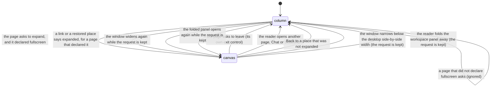

- **Owner.** The host keeps the request. Whether the page *holds* the canvas is derived on every read (`workspacePanelHoldsCanvas`): the request was made for this very page, the page declared `fullscreen`, the window is wide enough to show it, and the workspace panel is on screen. Neither a stale link nor a page that vanished (its plugin hidden, the workspace no longer a git checkout) can leave the reader under a hidden app bar with no way out, and a declared page shown in place of a missing one does not inherit the missing page's request (review `671724cc`).
- **The host draws no control and favours no plugin** (owner, 2026-10-02: "pi web只做通用性，不对任何特别的插件做特别支持"). A page declares `fullscreen: true` and draws its own controls: enter only while `host.workspacePanelFullscreenAvailable()` says the window can show it (the desktop side-by-side width, 1181 px and up), exit whenever `host.workspacePanelFullscreen()` is true.
- **Git** declares it. Its Expand key opens the review layout, every changed file's diff in one scroll, and reads "Exit expanded" there. No other bundled page declares it.
- **Producers of the stuck state found in review (`4d54a383`):**
  1. The removed header key was the only entry and the only exit, for every page.
  2. A link carrying `core.workspace--expanded=1` restored any page into the canvas.
  3. Opening another page through the quick switcher kept the flag for the next page.
  4. A link restored into the canvas while the reader had folded the workspace panel away: the fold's rule hid the page and the canvas rule hid everything else, leaving an empty window (review `671724cc`).

## D8. Where the reader is (navigation)

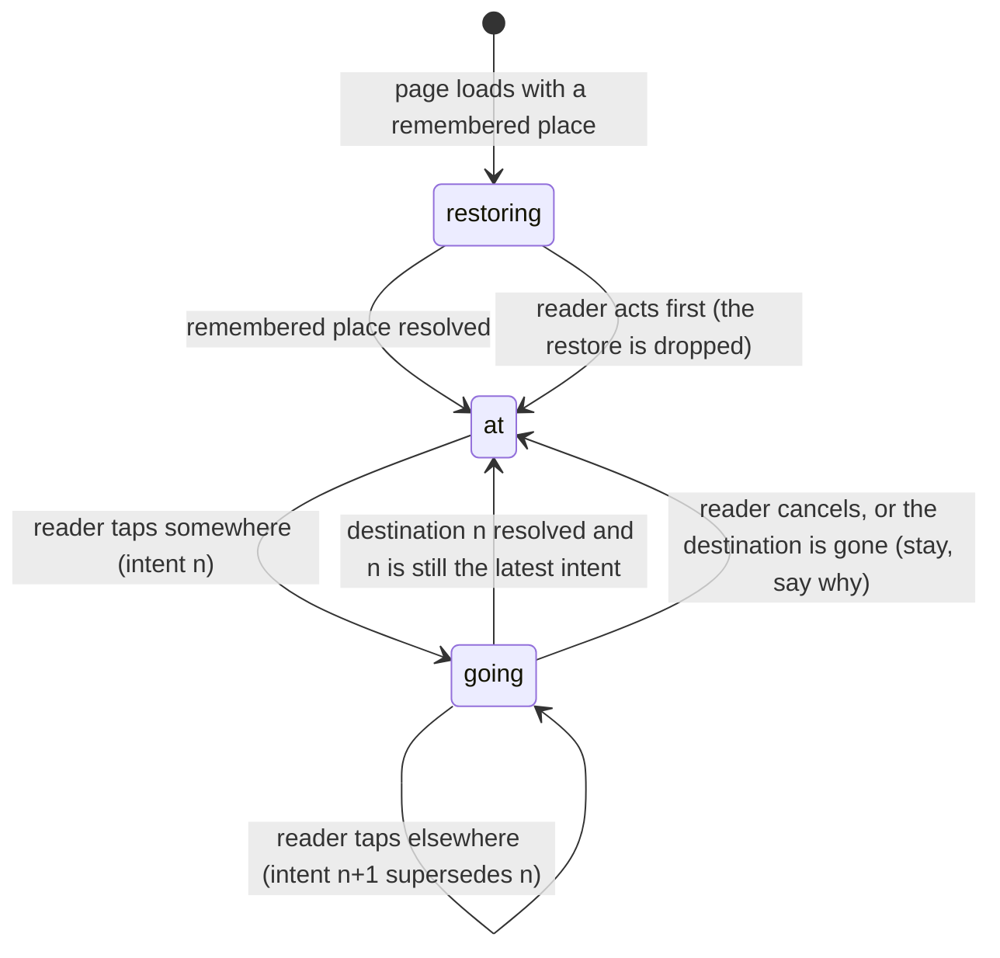

- **Owner.** One navigation controller. Every move is an *intent*, stamped with a sequence number from one counter: reader taps, back and forward, boot restore and machine-switch restore all draw from it. An async step commits a visible change only while its intent is still the latest.
- **The frame and its content change together.** The header, the page and everything actionable on it describe the same place at every moment. The previous place's content is never shown, and never actionable, under the next place's frame (owner, 2026-09-30: "it switched but the page content hadn't refreshed, then I kept operating on it… what I operate on is completely out of sync with what is really there"). A seed from the destination's own cache (same key) is allowed; another place's content is not.
- **Producers found (B29), as they were before the fix:**
  1. `openSessionFromQuickSwitcher` closed the Sessions page at tap time, uncovering the *previous* session's chat, live and sendable. It then awaited the machine move and `selectSession` (which returns only after the whole transcript read), and `focusChatComposer` forced the chat view even if the reader had gone elsewhere meanwhile.
  2. `restoreRouteFor` (boot restore, back and forward, machine switch, a terminal's workspace) awaited the machine and plugin loads and then set the view. `routeRestoreSeq` guarded only against a newer restore, not against a reader tap made meanwhile.
  3. The deep link to a fresh session that opens another one (audit P0-1, B31): the restore falls back to a different session while the URL still names the requested one.
  4. Deferred restores: a remote machine or project listing that failed at boot was retried on a timer, and the retry restored the boot route whenever it succeeded, however long after.
  5. A terminal run started with `open: true`, or a workspace removal, opened its terminal after awaited requests, even if the reader had moved on meanwhile.
  6. A second, half-built intent counter (`navigationSelectionSeq`) that only one unused method bumped.
- **Only the reader's intent moves the page.** A late answer to a superseded intent, a background refresh, a restore that the reader already overtook, or a list that reloaded never changes where the reader is (owner, 2026-09-30: "I didn't press anything… it suddenly jumped me to some screen I didn't recognise"; B29).
- **`going` stays in place and says so** (owner, 2026-09-30: "staying in place is fine, but how does the user perceive that they tapped this button?"). The screen stays where it is, live and bound to the place it shows (React Navigation's pending-navigation model). The tap is acknowledged within Nielsen's limits:
  - **within one frame (< 0.1 s):** the tapped item takes its `going` look: the selected highlight, and a spinner in place of its trailing mark, with `aria-busy` and an "Opening <name>" announcement. An indeterminate progress line runs along the top edge of the app. It is chrome-owned, so it stays visible even if the item scrolls away;
  - **after 1 s:** the item's text adds "Opening…";
  - **after 10 s:** the item reads "Still opening…"; going anywhere else cancels it;
  - **on failure:** the item reads "Couldn't open · retry" on its one secondary line (a tile never changes height), and the screen stays;
  - **a destination with a same-key seed** (a cached transcript, a loaded list) switches in the same frame. Only an unseeded destination waits, so the common case never waits;
  - **a tap elsewhere supersedes:** the earlier item returns to normal. A second tap on the same item does nothing, and a tap on a failed item tries again. Back, Escape or closing the list cancels `going` and closes the layer as usual.
- A tap that looks like it did nothing is how a later jump happens; `going` makes every tap visible.
- **Implementation (B29):**
  - One owner, `NavigationIntents` (`src/client/src/navigationIntent.ts`), holds the counter and the pending intent `{seq, key, phase}`. The phase is `going`, `slow`, `stalled` or `failed`, from the pure `navigationPhase(elapsed, failed)` classifier. `OPENING_WORDS` is its text table for the row, and `openingAnnouncement` is the one spoken line, naming the target in every phase.
  - Every reader navigation begins an intent:
    - a view choice (`selectMainView`);
    - opening or leaving the Sessions page;
    - back and forward;
    - closing a layer or the switcher (cancel);
    - a session tap;
    - choosing a project or widening;
    - browsing another machine's tab;
    - choosing or refreshing a machine;
    - New session;
    - opening Settings or Add project from the Sessions page.

    Code that only shows a view on the reader's behalf uses `showView`, which begins nothing, so a restore or a commit never cancels itself.
  - Opening a session:
    1. begin an intent;
    2. if the transcript cache has a seed for the session, commit at once;
    3. otherwise await the first page (`readFirstPage`, stored where selecting looks) and commit only if the intent is still the latest.

    "Commit" is closing the Sessions page and the switcher, showing the chat and selecting the session, in one synchronous step after the machine move, and only while the intent is current. The move goes to the machine the row was read from, whatever tab is showing when the read lands. Focusing the composer happens only inside a current commit. Selecting still reads the page again as it joins the live stream, behind the seeded transcript; B7 removes that second read.
  - `restoreRouteFor` takes the intent current when it was asked for and checks it at every checkpoint. The boot restore captures its intent before its first await and hands the same intent to both deferrals, so a tap made at any point of a flaky boot retires the retry.
  - A terminal run checks, once accepted, that the intent current at its start still is; `openRuntimeTerminal` checks again after restoring the terminal's workspace, and a workspace removal checks before opening its terminal.
  - The chrome draws the progress line from the intent. The tapped row draws its `going` look by comparing its key with the intent's target.
- **A deep link to a session opens that session, or says why it cannot.** It never silently opens another one (audit, B31).
- **One intent adds at most one history entry** (seen 2026-10-03, `probe-board-url.mjs` at load 11: Back from a chat opened on the phone board landed on "chat, no session"). A tap writes the URL once, when it commits, naming the place it committed to, as a new entry even when another write landed less than 400 ms before (`forcePush`). Its steps (the machine move, the view, the selection) write nothing on their own; a workspace pick that did not land still writes once so the URL names the machine it is on. A tap overtaken after it moved the machine writes only when the intent that took over will not: no route restore runs, no other open is on its way, and the URL still names another machine (`supersededMoveOwesUrl`); an overtaken workspace open picks nothing. A step that later corrects the place replaces that entry: a placement, the session target a not-found read publishes, and the locate's reopen of that session where it lives (`correctsUrl`). A restore that opens a session in another workspace is not a correction: its caller (a machine switch, a terminal run) writes the entry (review 1c0cb377). A placement or a correction rewrites only an entry that names its session (the session layer reads the address, `urlSessionId`): a restore's placement landing before its caller wrote leaves the entry to the caller, and a located session that answers after the reader went elsewhere opens nothing. An open that fails after overtaking a machine move names the machine the page is on (review ca45d6ed). A session the resolver finds opens only on the machine it was followed on: a machine switch whose route names no session leaves a pending retry behind, and its answer belongs to the machine the reader left. A selection whose caller left the push to it and whose first read answers not-found pushes that one entry (review ae155c79). The clock that merges writes 400 ms apart (`historyWrites.ts`) stays for the pieces of one surface (a tool and its arguments); it cannot tell one intent from two once a read takes longer. Producers found:
  1. a session tap: `showView("chat")` pushed the chat view before the selection, then the selection pushed the session once its first read settled; a cross-machine tap first pushed the machine as well;
  2. a workspace opened from the switcher: the machine move pushed, then the project or workspace pick pushed;
  3. a tapped row that answered not-found: the target's publication pushed, and the locate's reopen in another workspace pushed again (review ae155c79);
  4. still open: a machine choice whose restore finishes after a tap made during it writes second (pre-existing, CHECKLIST).

### The target of a session link (P2 slice b, B31; owner Q8)

A link, a boot restore, a switcher pick or a board pick names one session. Whether it can be opened is one value, `SessionTarget`, decided by one pure classifier from typed answers only:

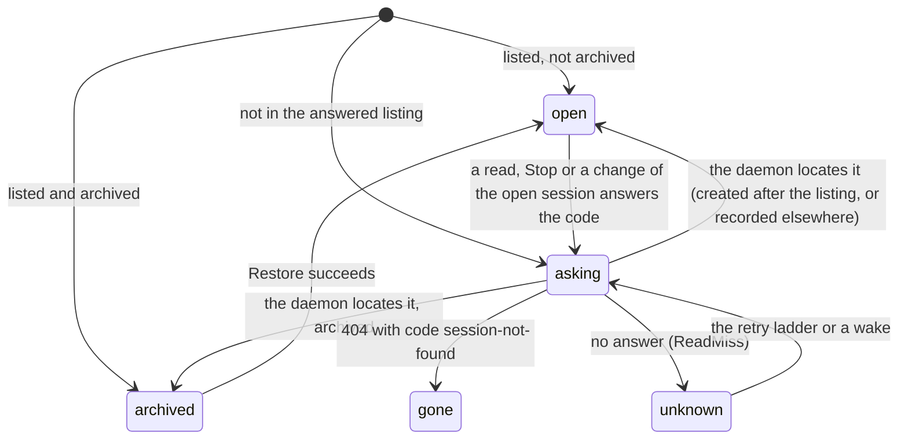

| state | the chat surface | the composer slot | the URL |
|---|---|---|---|
| `open` | the transcript | the composer | names the session |
| `archived` | the transcript, read-only | "This session is archived." with Restore | names the session |
| `asking` | "Loading this session…" | nothing | names the target |
| `unknown` | "Loading this session…"; the app row says why (`ReadMiss`) | nothing | names the target |
| `gone` | "This session no longer exists on *machine*." with a way back to the workspace's sessions | nothing | names the target |
| `not-listed` (an older daemon) | "This session isn't in *workspace* on *machine*." with the way back | nothing | names the target |
| `folder-gone` | "This session's folder no longer exists, so it cannot be opened." with the way back | nothing | names the target |
| `refused` | "*machine* asked you to sign in before it opens this session.", or "*machine* refused to open this session.", with the way back | nothing | names the target |

The way back forgets the target: the URL stops naming it, and the phone shows the workspace's Sessions page.

A link that names a workspace but no session lands where the layout puts the reader, and the URL says so (built 2026-10-03, `probe-workspace-link.mjs`). The wide layout (a fine pointer, wider than 760 px) shows a chat, so it opens the workspace's latest session and the restore names it in the URL, replacing the entry only while the URL still holds the route being restored and the restore is still the reader's latest intent: a machine switch or a terminal run restores a route the URL does not hold yet, and its caller pushes its own entry (review 61021b3f). A reload then opens the same session after a newer one appears. The phone layout (narrow, or any coarse pointer) shows the workspace's Sessions board and selects nothing: before, it selected the latest session behind the board and read its transcript (the 17.8 MB seed on 8505) for nobody, and the URL could not name it.

- **Absence is not negation.** A target missing from the listing is `asking`: the daemon is asked where that id is, machine-wide (`GET /sessions/:id/locate`), because the listing is of one workspace's tree and a read by the workspace's cwd cannot see a session recorded in a subdirectory, or an archived one recorded there. Only the daemon's code makes it `gone`. A located session opens where it lives, as a switcher pick does. The fallback to the latest session applies only when no session was named.
- **An older daemon without the locate route** answers the route-not-found envelope. For one release, the answered listing is then the evidence, and the words say only what it proves: "This session isn't in *workspace* on *machine*."
- **Nothing else is selected** while the target is `asking`, `unknown` or `gone`. On the phone, the chat view stays on screen for the target instead of falling back to the Sessions page, so the answer is visible.
- **`gone` is final for that id** until the reader navigates. It is not retried, and it never becomes another session.
- **The open session answered the code** (P2 slice b part 2; owner, 2026-10-01: "那就报错啊，说被删了", report it as an error that says it was deleted).
  - The code came from a read by that session's own directory. It proves only that the session is not there, not that it is gone from the machine: it may have been archived on another device.
  - So the open session becomes a named target, `asking`, and the same machine-wide locate decides it: `gone` shows the gone words and the way back; `archived` opens it read-only with Restore; found elsewhere opens it there.
  - Every read and change of the selected session reports its failure through one seam, which does this only when the failure is the code and the call concerned the selected session. A rename or archive of another row that answers the code stays a notice about that row. A client pending row (a temporary id the machine cannot locate) and sends are outside the seam.
  - The URL names the id once the target is published, so a reload shows the same answer, including after a pick that had already written the previous session's route.
  - A session the resolver opened after that locate and that answers the code as it opens is `gone` at once: asking again would only loop. A locate that got no answer, or an open that failed for another reason, arms nothing.
  - With no selected workspace to send the reader back to, the old words stand ("Couldn't load this session." with the daemon's reason).
  - The page learns of a deletion only at its next read of the session (a socket reconnect, a resync, a tab resume, Stop or another change). The daemon pushes no deletion; that is the heads work (B28).
- **A message sent to a session deleted meanwhile** is an open owner question: where its text goes once the composer gives way to the gone words. Until it is answered, a send keeps its failed row, and the next read of the session routes the page to `gone`.
- **Restore is in the composer slot** (owner, 2026-10-01): an archived session shows "This session is archived." and Restore where the composer would be.
- **Producers before the fix:** `selectPreferredSession` fell through to the latest session (seen on 8505: a link to a deleted id opened "probe warm reply" while the URL kept the deleted id); a refresh of the open session that answered the code read "Couldn't load this session."; a pick of a row deleted since the board was read read "Couldn't open"; an archived session opened with a disabled composer and no reason; Stop on a missing session answered "stopped".

## D7. A goal (our own goal plugin, replacing pi-goal's flow)

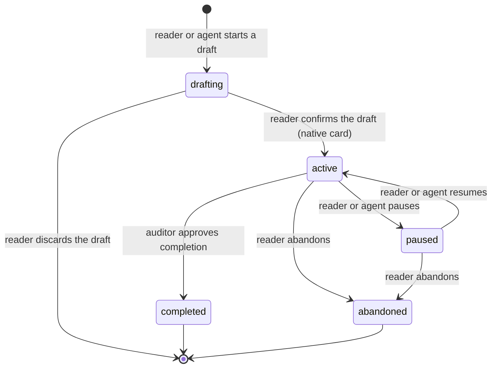

- **Focus** is a separate region: `unfocused` ⇄ `focused(session)`.
  - Focusing in another session releases the first one.
  - Focus is released only by a named arrow (focus elsewhere, pause, complete, abandon). A reconcile against a cache it cannot trust yields `unknown`, never a silent release.
  - A report ("created and focused") is derived from the stored state after the write.
- **Continuation** is a region too: `idle` → `waiting-quiescence` (no subagent run or background task active) → `injected`, or `fallback-fired` after a bounded wait.
- **The goal record format belongs to the goal plugin, and so does its reader.** Nothing else parses the files. A file that cannot be read is shown as unreadable, never as "no goals" (B27).

## Methodology folded in (research run `e7c7403c`, `uiux-methodology.md`)

- **Statecharts** (statecharts.dev; Stately testing docs):
  - each domain here is a tagged union, not a set of booleans;
  - the classifier owns events and guards, and components only execute;
  - every domain gets one table-driven test over every (state, event) pair, so an unhandled pair fails CI;
  - nothing the UI must show is a transient state.
- **Nielsen #1, #3, #4, #5** (NN/g):
  - the status line narrates (D3);
  - every mode has a visible exit (selection `✕ Done`, card Cancel, back-to-bottom);
  - one meaning per gesture on both platforms (long press selects; ⋯ is a row's actions; ≡ is navigation);
  - destructive actions are offered only in states where they make sense.
- **Mature chat apps** (Telegram `random_id` and `pts`/`seq`; WhatsApp ticks; iMessage "Not Delivered · Try Again"):
  - reconcile by client id;
  - order by server sequence;
  - a small monotonic ladder of marks;
  - failure as an actionable state on the row (D1).
- **Stick to bottom** (TanStack Virtual end anchoring; use-stick-to-bottom):
  - follow only when pinned;
  - tell user scrolls from ours;
  - keep keyed items in place on prepend;
  - do not rely on CSS `overflow-anchor`, which Safari lacks and many layout changes suppress (D4).
- **Sheets and nested scroll** (Material 3; MDN `overscroll-behavior`):
  - an inline card is a standard sheet, usable alongside the transcript;
  - its height is capped and its body scrolls inside it;
  - `contain` on a region that does not overflow blocks chaining, so it is for overlays only (D2).
- **Selection mode** (Material selection; Android contextual action mode): the contextual bar replaces the top bar; a tap toggles once in the mode; the mode exits on Done, Back or an empty selection, and after an action runs (docs/design/bulk-selection.md). Material prefers undo to confirmation; the owner chose confirmation with a count for Delete permanently, and that stands.
- **Navigation** (NN/g contextual menus and banner blindness; WCAG 3.2.3): the ≡ menu is global navigation, and plugin pages are its entries, in a stable order. Banners are ignored and take space, so none are injected (rule 7).

## Bug index

Every owner report, the domain it breaks, and its producers (file:line in the inventories).

| # | Owner report | Domain | Broken | Producers | Checklist |
|---|---|---|---|---|---|
| B1 | "Queued · 2" drawn above "Queued · 1" | D1 | pending ordered by `seq` | `userMessageRegister.ts:95-124` (source-precedence Map order); `ChatView.ts:1596-1598`; daemon status list composed lane by lane (`piSessionService.ts:6409-6420`); `restoreFront` at the head (`:3220`) | p0-message |
| B2 | an earlier message drawn below a later one (it carried a dialog) | D1, D2 | one row, placed by state | `transcriptReconcile.ts:65-86` (waiting rows appended at the end on rebuild); `userMessageRegister.ts:119-121` | p0-message |
| B3 | a consumed message still reads "Queued" | D1 | one state; `committed` and `consumed` are daemon facts; a snapshot never regresses | no `handed`, `committed` or `consumed` frame (`apiTypes.ts:1552-1554`); `messageDelivery.ts:374-380`; `userMessageRegister.ts:115-121`; commit claimed by text (`committedPromptIdentity.ts:39-45`); duplicate send answered `accepted` (`piSessionService.ts:3148-3149`) | p0-message |
| B4 | old messages suddenly reappear in the queue | D1 | a return keeps identity and times; automatic resend bounded | outbox replay (`PromptEditor.ts:1208-1246`, `pendingOutbox.ts:387-391`); `carryUnsettledForward`; take-back fallback re-mints `acceptedAt` (`piSessionService.ts:3518`); restart hand-off not shown as queued | p0-message |
| B5 | one message, two timestamps | D1 | one timestamp that never moves | `messageDelivery.ts:45` versus `:419-426` | p0-message |
| B6 | a message shown twice; states not strict | D1 | one authority | S1/S2/S8 are three authorities; no committed-entry join on rebuild | p0-message |
| B7 | a long-open page keeps hours-old rows until a reload | D5 | head compared; tail loss detected | the heartbeat `head` has no client consumer; delta replay from a stale persisted page (`sessionController.ts:1688-1734`, `:1768`) | sync |
| B8 | the All-projects list shows only pins | D5 | one state per source | `PiWebApp.ts:2855-2875` | sync |
| B9 | a terminal screen first, the native card only after Close | D2 | one native card per question | host lacks `piWebScreens` (unreleased since `.28`); `openCustomScreen` mounts the TUI (`piSessionService.ts:2127-2168`); pi-goal falls back to `select` | native-screens |
| B10 | "dialog title exceeds its length limit", invisible to the reader | D2 | a refusal is visible | `pendingExtensionDialogStore.ts:108, 300-307`; pi-goal's fallback title | native-screens |
| B11 | the wheel over a card scrolls nothing | D2, D4 | one inner region that chains | `ExtensionDialogCard.ts:514-527, 695`; `AskUserCard.ts:613-619` | native-screens |
| B12 | a special message pushes the ask card down; the reader has to scroll | D4, D2 | only reader intent releases `following` | render-time unpin `ChatView.ts:1107`; untagged programmatic scrolls `:2714`, `:2725-2726`; four writers | native-screens |
| B13 | the view jumps while the reader is above | D4 | nothing moves a reader | snap on a newer page (`viewportDecision.ts:110`); prepend settle during a gesture (`ChatView.ts:2890-2906`) | native-screens |
| B14 | the dock says working while the session is idle | D3 | one classifier; labels are output | `ChatView.ts:1942-1970, 3024` | p0-message |
| B15 | activity flaps between idle and working within a turn | D3 | one `idle` per turn | `piSessionService.ts:5558` | p0-message |
| B16 | state decided by comparing text (20 sites) | all | words are output; identity is an id | status-and-strings inventory, Scope B | maintenance |
| B17 | "Goal created and focused" but nothing is focused | D7 | a report derives from stored state; focus released only by a named arrow | `pi-goal/goal-drafting.ts:384-397`; `goal-state.ts:421`; `storage/goal-files.ts:53`; `goal-service.ts:292-303` | own-goal-plugin |
| B18 | the update prompt pops up in every session | D6 | global prompts are machine-scoped | pi-updater's per-session `session_start` prompt | updates |
| B19 | a plugin toggle needs a restart and leaves the plugin on the page | D6 | toggles are live | `serverRestartRequired`; `registry.disposePlugin` never called | plugin-lifecycle |
| B20 | core counts subagent runs | D3, D6 | the background count is plugin-contributed | `backgroundRunCount.ts:72-101` | plugin-lifecycle |
| B21 | a custom-screen redraw may not repaint | D2 | the rendered state equals the owner's | `askCardIdentity.ts:43-54` omits `lines` and `screen` | native-screens |
| B22 | a closed card is still tappable | D2 | a closed card is inert | the held copy kept live handlers, and was kept only once every card had closed (`ChatView.renderWaitingForYou`); fixed by `waitingSlotHold` (9012de88 and its follow-up) | native-screens |
| B23 | the Goals plugin draws a banner bar over the transcript; two header bars | D6, rule 7 | plugins show only as Go to page entries and appendages | `drawerSections` (`plugins/types.ts:375`), rendered by `ChatView.renderTopDrawer` (`ChatView.ts:1465`) | plugin-surfaces-goto |
| B24 | the context meter reads "ctx 291.5%" after a model change | D3 | usage carries its model; a mismatch is `unknown` | context usage measured against another model's window (to trace) | sync |
| B25 | "message queued · 10m 51s" while the agent works; queued messages wait with no reason | D3 | the status line narrates the step and what comes next | activity label published once at acceptance (`piSessionService.ts:3178`) and re-published by the heartbeat (`:5415-5431`) | p0-message |
| B26 | an ask answered long ago appears only now | D1, D2 | an answer is a queued message, handed at the next injection point | `submitAsk` → `sendCustomMessage(…, { deliverAs: "followUp" })` (`piSessionService.ts:1995-1997`); subsession notices likewise (`:2688`) | p0-message |
| B27 | "No goals in this workspace" while a goal is active | D7, rule 5 | the goal plugin owns its format; an unreadable file is not "none" | pi-goal appends a `# Goal Prompt` section after the JSON; `pi-web-plugins/goals/server-plugin.ts:31-40` parses the whole file as JSON, counts both as broken, and the page says "No goals" | own-goal-plugin |
| B28 | the All-projects session list is not ordered by latest activity, or is stale | D5 | every surface is live; list order comes from a daemon activity fact carried on the list head | the machine-wide list is fetched once and cached for `QUICK_SWITCHER_REFRESH_MS` (`PiWebApp.ts:2820-2826`), not event-driven; order is `modified` at fetch time | sync |
| B29 | the page jumps to another screen with no tap from the reader | D8 | only reader intent navigates; superseded or overtaken intents never move the page | to trace: late navigation completions and restores (`PiWebApp` selection paths, boot restore) | sync |
| B30 | a manual Stop gives no feedback: no message, no status, straight to idle | D1, D3 | a Stop is a visible settled outcome whatever it cut | the "You stopped this turn" row (`af070d94`) is unreleased; on main a Stop that cuts no reply (during a tool call, before any text) leaves no row, and the status shows `idle` without saying why | p0-message |
| B31 | a URL naming a new session shows another session, with live actions | D8, D5 | a named session opens or says why not | boot restore falls back to another session while the URL keeps the requested id (audit 5d672be6) | navigation |
| B32 | streamed text is not shown until the turn ends | D1 | a streaming reply is one row growing in place | not PI WEB: the owner's pi-multi-account extension wraps every provider's fetch with a diagnostic that awaits `response.clone().text()` before returning (its `src/index.ts` traced fetch and api.anthropic.com wrapper), so pi sees each reply only when it is complete. Reproduced on a real provider and with `probe-stream-grows.mjs`; pi CLI bisect: only that extension batches. Fix on its branch `fix/stream-not-buffered-by-diag` (fa8dbda), not pushed | p0-message |
| B33 | queued messages are handed one per request | D1 | batch handoff at the injection point | three requests 16-20 ms apart (audit fake.log) | p0-message |
| B34 | the final model error is raw JSON | D1 | an error is a sentence plus Details | `Model response failed: 500: {...}` | p0-message |
| B35 | phone targets under 44 px | rule: coarse floor | hit areas at the floor | 22, 24 and 36 px targets (three audit lanes) | maintenance |
| B36 | a queued row has two near-identical take-back keys | D1 words | one take-back action | Recall and Put back side by side | p0-message |
| B37 | a top-level menu is missing from some screens | D8 | every screen reaches Go to and Settings | no Go to on the board, no Settings in a phone chat | navigation |
| B38 | a failed plugin toggle leaves a contradictory card | D6 | a failed save reverts and says why | EACCES on a read-only config; card says "Desired enabled" beside an unticked box | plugin-lifecycle |
| B39 | the Actions palette has no touch opener | D8 | every surface reachable by touch | `actions.show` is the only opener | navigation |
| B40 | permanent delete uses `window.confirm` | chrome | the app's own dialog | `PiWebApp.ts:2742` | bulk |
| B41 | the URL does not describe the Sessions board | D8 | a place survives a reload | not reproduced since D8 (2026-10-03, `probe-board-url.mjs` 5/5): the phone shows the board only when no session is selected (the way back forgets the target; ≡ opens the Go to page over a chat), so the board's URL names no session and a reload keeps it. The audit's path, "Sessions" in Go to from an open session, no longer exists | navigation |
| B42 | `#` search has no suggestions and misses shown states | - | tags are discoverable | only three derived tags | maintenance |
| B43 | Archived hides at 0 and sits seven screens down | bulk | a stable home for Archived | group removed when empty | bulk |
| B44 | phone board chrome takes 20 % of the screen | D4 | owner: keep as it is | 171 px pinned | closed |
| B45 | desktop first boot says "Select a project" beside a populated list | D8 | the empty centre says what to do next | `workspacePanelEmptyState` | navigation |
| B46 | the board's grid key is a no-op | D8 | a key does something or is absent | `aria-pressed` with no effect | navigation |
| B47 | `machineSections` is never rendered | D6 | render it or remove it | no caller of `getMachineSections` | plugin-lifecycle |
| B48 | a read that got no answer freezes a surface at "Couldn't read…" | D5 | a surface is live, syncing or reconnecting, never failed; it retries by itself | `projectsLoad: "failed"` and twelve siblings (D5 table) | sync |
| B49 | a pinned session in a closed project vanishes from PINNED, and a link to it lands on the board | D8 | pins are global and outlive projects: PINNED is resolved from the pinned ids by the daemon, tapping opens the session without reopening its project, closing a project says nothing about pins, and global and project pins are two separate kinds (owner, 2026-09-30) | PINNED is built from the open projects' lists; the pin stays in `session-pins.json` | live-surfaces |
| Fixed | Enter picking an IME word sent the message | composer | the IME owns its key | fixed in `3c449543` | done |
| Fixed | the row menu did not fold on a second tap; no Archive or Delete | menus | one transition per tap | fixed in `a97f6c60` | done |

## Review triage (2026-09-30)

Two lanes reviewed the first draft: closure (Opus 5.5, **FAIL**, all fixes documentary) and consistency (DeepSeek 4.1 max, **PASS WITH FIXES**). Every finding is recorded here, with what was done.

### Closure lane (Opus 5.5)

| Finding | Verdict | Disposition |
|---|---|---|
| F1 `handed` is a dead end for commands and rewritten prompts | true | **Fixed.** Added `consumed` (from `handed` and `unverifiable`), `committed` as a daemon fact through `prompt.committed`, and `[*] → committed` for entries without an id. The text claim is listed as rule-2 debt. |
| F2 duplicate, out-of-order and post-restart cells | true | **Fixed.** Rule 3 now has forward ranks and skip-forward; the ledger answers from `unverifiable`; `[*] → queued`; `handed → unverifiable` on restart; the duplicate reply carries the ledger outcome. |
| F3 `handed` and the return are unobservable | true | **Fixed.** New frames `prompt.handed`, `prompt.returned`, `prompt.committed` and `prompt.consumed`, each with `seq` and `acceptedAt`. The status list never changes state. The position is `{epoch, seq}`. |
| F4 `superseded` contradicts FIFO and the code | true | **Fixed.** Removed. The real trigger, a chat message closing the oldest ask, is a typed cancel cause. |
| F5 D2 missing close events; no plugin-card point | true | **Fixed.** Typed cancel causes, including `owner-disabled`, `daemon-restart` and `session-closed`; the waiter always resolves; a `dockedCards` contribution point through the plugin's server half. |
| F6 D3 drops `background`; `error` has no exits; out-of-turn work | true | **Fixed.** `background` drawn, with a plugin-contributed count; precedence asking > error > working > background > idle; error exits added; compaction, bash and navigation added. |
| F7 D7 is not a state machine | true | **Fixed.** D7 drawn with lifecycle, focus and continuation regions, from the owner's AGENTS.md definition. |
| F8 B24 not closed; capping would hide it | true | **Fixed.** Usage carries its model; a mismatch is `unknown`; capping is rejected. |
| F9.1 `refused` is retryable in code | true | **Fixed.** `refused → sending: Retry`. |
| F9.2 no discard exit | true | **Fixed.** `→ discarded`. |
| F9.3 automatic replay versus Retry | true | **Fixed (decided).** Automatic resend only for `notSent` records of this device under 10 minutes old; `unverifiable` records are re-asked, not resent. |
| F9.4 `queued` × daemon restart | true | **Fixed.** Queued survives, stays visible, and is handed at the next injection point. |
| F9.5 client-queued sends unmapped | true | **Fixed.** They are a persistence of `sending`. |
| F9.6 B4 citation partly stale | true | **Fixed.** Cited as the fallback path (`:3518`). |
| F10 transcript tail order undefined; dialog multiplicity | true | **Fixed (decided).** Tail order stated in D1. Every open card renders FIFO. |
| F11 D4 matrix gaps | true | **Fixed.** `restoring` exits, `jumping`, the definition of the bottom, sending a message as intent, no compensation during a gesture, a still touch is not intent. |
| F12 D5 gaps | true | **Fixed.** `current → diverged` on a new epoch, `diverged → unknown`, per-source state for aggregates, tab resume. |
| F13 D6 gaps | true | **Fixed.** `disabling → failed`, `enabling → disabling`, `enabled → failed`, the two-process rule, the B23 rule in the body, and B18's per-machine store. |
| F14 rule 2 correlation exceptions | true | **Fixed.** Named as debt in rule 2. |
| F15 refusal notice lifetime; "answered elsewhere" | true | **Fixed.** A session notification (owner, scope, dismissal); "Answered elsewhere" on a stale tap. |
| Suspicion: heartbeat budget drift | false | No change. |
| Suspicion: FIFO by seq conflicts with lanes | false | No change: every entry is `lane: "steer"`. |

### Consistency lane (DeepSeek 4.1 max)

| Finding | Verdict | Disposition |
|---|---|---|
| P1-1 `background` missing, yet called an appendage | true | **Fixed.** The category is core; the count is plugin-contributed; the words are the plugin's appendage. |
| P1-2 frames that do not exist; `acceptedAt` and `seq` not on the wire | true | **Fixed.** Named as new under rule 6: the frames, `acceptedAt` on frames and queue entries, and `seq` as a persisted inbox field. |
| P1-3 D2 and D6 both own a plugin card | true | **Fixed.** The store owns the card until it settles; disabling cancels it (`owner-disabled`). |
| P1-4 no join between `clientMessageId` and entry id after a rebuild | true | **Fixed.** `prompt.committed` carries both keys; on rebuild a pending record found on a reloaded entry becomes `committed`. |
| P2-5 `superseded` versus FIFO | true | **Fixed** (same as F4). |
| P2-6 "no nested scroller" versus the card's 60vh budget | true | **Fixed.** One capped inner region that chains at its end; `contain` for overlays only. |
| P2-7 FIFO has no daemon-side producer | true | **Fixed.** The daemon emits the list in `seq` order; the composer and `restoreFront` added to B1. |
| P2-8 an off-screen card in `reading` is invisible | true | **Fixed.** It lights the back-to-bottom key with "Waiting for you"; the reader is not moved. |
| P2-9 `{epoch, revision}` is a third ordering owner | true | **Fixed.** The status position is `{epoch, seq}`; revisions are for cards and lists. |
| P2-10 the timestamp moves and mixes clocks | true | **Fixed (decided).** Client send time for this device's sends, `acceptedAt` otherwise; it never switches. |
| P2-11 error versus asking precedence | true | **Fixed.** asking outranks error. |
| P3-12 `received` and the other browser stores unnamed | partly true | **Fixed differently.** The POST answer is itself the acceptance, so it enters `queued`; the word "Received" maps to `handed`. The pre-start queue and the outbox are persistences, not states. |
| P3-13 rule 2 versus the parsed screen | true | **Fixed.** The named permanent exception, with `unknown` falling back to the raw frame. |
| P3-14 D6 never states where plugin content lives | true | **Fixed**, and superseded by the owner's 2026-09-30 ruling: pages as Go to page entries, appendages, docked cards; no bars (rule 7). |

### Decisions taken here (the owner may override any)

1. A message's shown time is the client send time for this device's sends, and `acceptedAt` otherwise.
2. Automatic resend only for `notSent` records of this device under 10 minutes old.
3. Every open card renders, FIFO.
4. Sending a message is reader intent: the view follows.
5. Precedence: asking > error > working > background > idle.
6. The pre-owner "Received" word maps to `handed`.
